# 🚀 GEO — 生成式引擎优化系统

> 让你的内容和品牌更容易被 **ChatGPT / Perplexity / Gemini / Claude / 通义千问 / 智谱 GLM / DeepSeek / Kimi** 等 13+ AI 搜索引擎引用。

基于 **Princeton GEO** (KDD 2024) 的 9 种优化策略，融合 **AutoGEO** (ICLR 2026) 的 GEO/GEU 双评分体系，面向中文市场深度本地化。

---

## 📖 文档导航

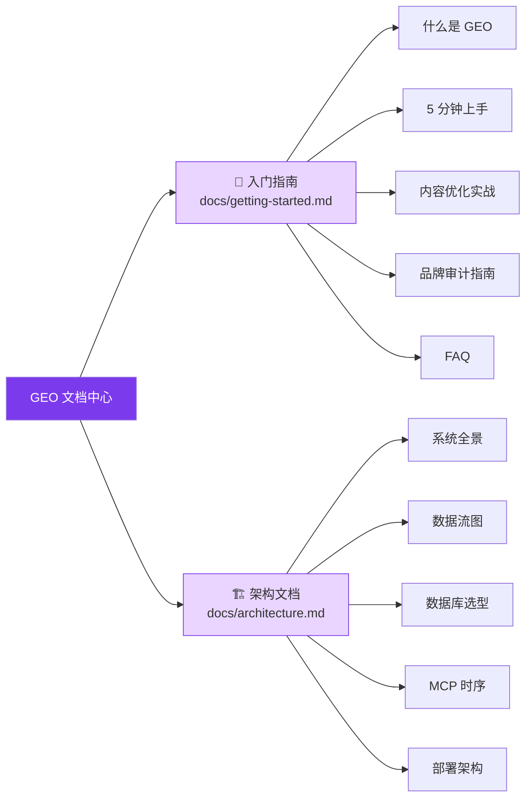

| 文档 | 说明 | Mermaid 图表数 |
|---|---|---|
| 📘 [入门指南](docs/getting-started.md) | GEO 概念、5 分钟上手、优化实战、审计指南、FAQ | 12+ |
| 🏗 [架构文档](docs/architecture.md) | 系统全景、数据流、数据库选型、MCP 协议、部署 | 15+ |

### 🖥️ 部署硬件快速参考

MyGEO 不做本地 LLM 推理（全部走云端 API：OpenAI / GLM / DeepSeek / Qwen 等），**无需 GPU**，按 CPU / 内存 / SSD 三要素选型即可。生产推荐 **Linux x86_64 / arm64**，公网出口 ≥ 100 Mbps：

| 场景 | 形态 | CPU | 内存 | SSD | 典型用户 |
|------|------|-----|------|-----|----------|
| 🟢 试用 / 个人 | 单机二进制 | 1-2 vCPU | 1-2 GB | 10 GB | 开发者 / 单品牌 Demo |
| 🔵 小团队 | Docker Compose | 2-4 vCPU | 4-8 GB | 50-100 GB | 10-20 人市场/SEO 团队 |
| 🟠 大规模生产 | K8s / 多副本 | 无状态 1/2 vCPU Pod×2+<br/>MySQL 4/8 vCPU<br/>Redis 2/4 vCPU | 无状态 2/4 GB<br/>MySQL 8/16 GB<br/>Redis 4/8 GB | MySQL ≥ 200 GB nvme<br/>共享存储 ≥ 100 GB | SaaS 多租户 / 日审计 ≥ 500 品牌 |

> 完整规格（含容量估算公式 / Playwright / 本地嵌入模型 / 跨 AZ 高可用）见 [architecture.md §10 硬件要求与部署规格](docs/architecture.md#硬件要求与部署规格)。

---

## 🎯 系统全景

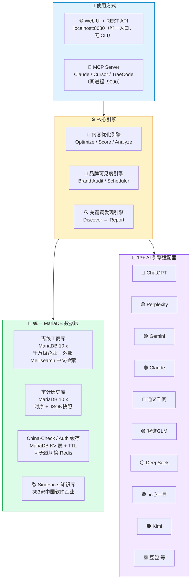

---

## 💎 核心能力矩阵

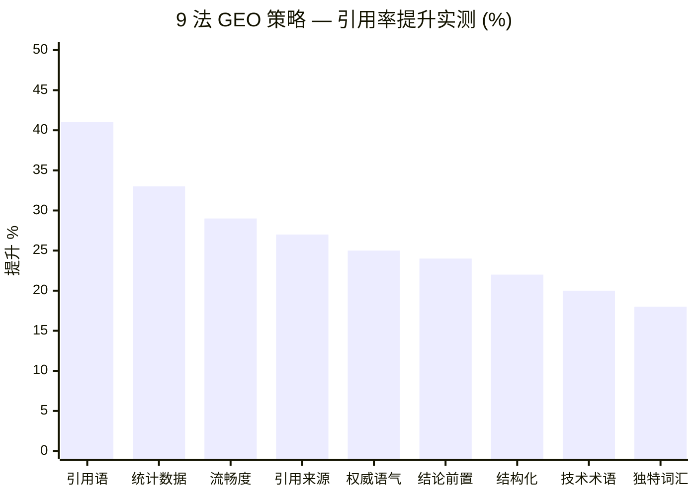

> **Princeton GEO (KDD 2024)** 论文实测数据

### 三大核心能力

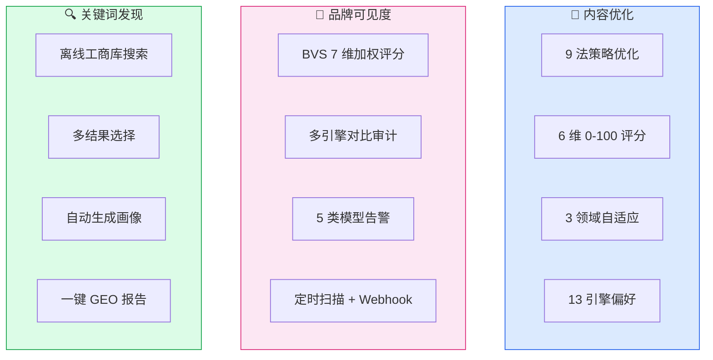

### 商业化与交付能力

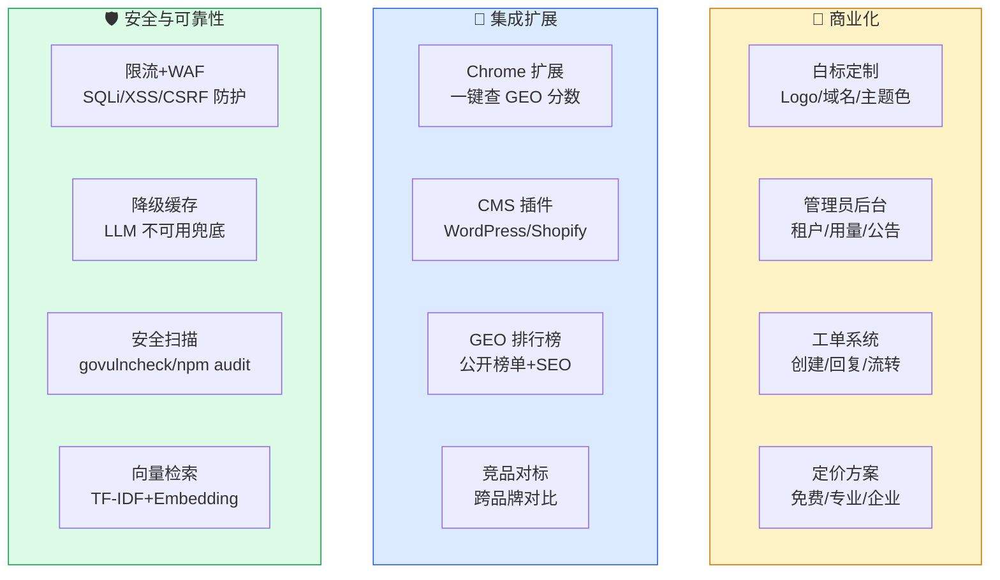

---

## 🗄 数据库选型（按功能模块化）

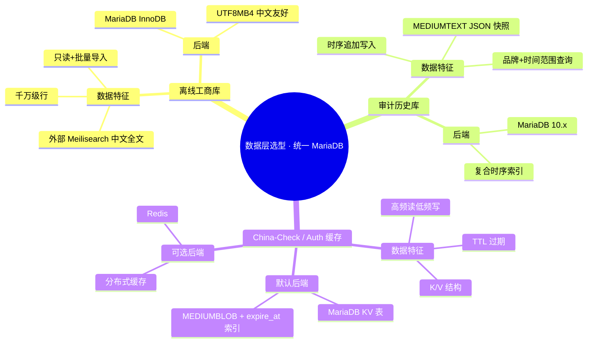

| 模块 | 数据特征 | 🛢 生产级后端（默认） | 🚀 可选分布式 | 环境变量 |
|---|---|---|---|---|
| 离线工商库 | 千万级行 + 中文全文检索 | MariaDB 10.x + 外部 Meilisearch（中文全文） | — | `GEO_MYSQL_DSN` |
| 审计历史库 | 时序写入 + JSON 快照 | MariaDB 10.x（兼容 MySQL 8.0） | — | `GEO_MYSQL_DSN` |
| CC 查询缓存 | K/V + TTL + 高频读 | MariaDB KV 表（兼容 MySQL） | — | `GEO_MYSQL_DSN` |
| 账号 / 会话 | 用户 + 工作区 + 刷新令牌 | MariaDB 10.x（兼容 MySQL 8.0） | — | `GEO_MYSQL_DSN` |

> **前置依赖**：首次部署需要一个可访问的 MariaDB 10.6+ 实例（docker / 云 RDS / 本地服务均可；ngram 依赖已移除，MySQL 8.0+ 同样可跑），账号需具备 `CREATE TABLE / INDEX / DML` 权限。

---

## 🚀 5 分钟快速开始


### 安装方式（二进制）

```bash
# 方式一：Go install
go install ./cmd/geo

# 方式二：Makefile
make build    # 产物 bin/geo

# 二进制直接运行（无 Docker 亦可）
bin/geo   # 或 go run ./cmd/geo（.env 同目录自动加载）
```

> 首次运行前需先初始化数据库与队列：把 `deploy/initdb/schema.sql` 导入你的 MariaDB/MySQL 实例
> （`mysql -h<host> -u<root> -p < deploy/initdb/schema.sql`），并确保 Redis 可达。
> 引导类变量（`GEO_MYSQL_DSN` / `GEO_REDIS_ADDR` / `GEO_AUTH_ENABLED` / `GEO_JWT_SECRET` / `GEO_ADMIN_*`）
> 走环境变量；其余运行参数只读 DB（app_settings），启动后到「系统设置」修改。

### 🐳 容器运行方式

提供两种容器化运行方式：方式 A（Dockerfile 单容器）需自备 MariaDB/Redis 并填写 `.env`；方式 B（Docker Compose）一键拉起 geo + MariaDB + Redis + Meilisearch，**零配置无需 `.env`**。工商中文检索默认已随 compose 内置 Meilisearch，方式 A 可外接（可选）。

#### 方式 A：Dockerfile 单容器（自带构建）

```bash
# 1) 先构建基础镜像（预装 Go/Node 与依赖，日常增量构建很快；仅需一次）
docker build -f Dockerfile.base -t geo-build-base:latest .

# 2) 构建应用镜像（Dockerfile 两阶段会顺带构建前端 SPA 并 go:embed 进二进制）
docker build -t geo:latest .

# 3) 运行（--env-file 注入全部引导变量；端口 8080）
docker run -d --name geo-server -p 8080:8080 --env-file .env geo:latest
```

- 若使用外部已有的 MariaDB/MySQL 与 Redis，把 `.env` 里的 `GEO_MYSQL_DSN` / `GEO_REDIS_ADDR` 指向它们即可。
- 工商中文检索可选接外部 Meilisearch：在 `.env` 填 `GEO_MEILISEARCH_URL` / `GEO_MEILISEARCH_API_KEY`（见下方「可选：外接 Meilisearch」）；留空则自动降级为 `LIKE` 模糊匹配。

#### 方式 B：Docker Compose（一键拉起 geo + 数据库 + Redis + Meilisearch）

仓库已内置 `docker-compose.yml`：**geo 服务直接使用 ACR 公网镜像**（无需本机构建），mariadb/redis/meilisearch 一并拉起，零配置即可运行。仅需：

```bash
docker compose up -d
```

> 内置 `docker-compose.yml` 关键约定：
> - `geo` 镜像为 `crpi-0xi5k79l9j4opzta.cn-hangzhou.personal.cr.aliyuncs.com/codeup2026/geo:latest`，无需本地 `docker build`。
> - 账号口令（`geo` / `geoRootPass`）已写入 compose 与 `schema.sql`，无需 `.env`。
> - **Meilisearch 默认无鉴权**（`MEILI_ENV: development`，不设 `MEILI_MASTER_KEY`）；如需生产鉴权，把 `MEILI_ENV` 改 `production` 并填 `MEILI_MASTER_KEY`（≥16 字节），同时给 `geo` 加 `GEO_MEILISEARCH_API_KEY` 同一串。
> - `mariadb` 挂载 `./deploy/initdb` 到 `/docker-entrypoint-initdb.d`，数据卷首次初始化时由 MariaDB 官方镜像以 root 自动执行 `schema.sql`，**无需手动建库**。

核心片段（完整以仓库 `docker-compose.yml` 为准）：

```yaml
services:
  mariadb:
    image: mariadb:11
    command: --character-set-server=utf8mb4 --collation-server=utf8mb4_unicode_ci
    environment:
      MARIADB_ROOT_PASSWORD: geoRootPass
    volumes:
      - ./deploy/initdb:/docker-entrypoint-initdb.d:ro   # 首次启动自动执行 schema.sql 建库建表
      - mariadb-data:/var/lib/mysql
    healthcheck:
      test: ["CMD", "healthcheck.sh", "--connect", "--innodb_initialized"]
      interval: 10s
      timeout: 5s
      retries: 10

  redis:
    image: redis:8-alpine
    volumes: ["redis-data:/data"]
    healthcheck:
      test: ["CMD", "redis-cli", "ping"]
      interval: 10s
      timeout: 5s
      retries: 5

  meilisearch:
    image: getmeili/meilisearch:latest
    # 默认无鉴权（development）；production 模式强制要求 MEILI_MASTER_KEY
    environment:
      MEILI_ENV: development
      MEILI_NO_ANALYTICS: "true"
    volumes: ["meili-data:/meili_data"]
    healthcheck:
      test: ["CMD", "curl", "-f", "http://localhost:7700/health"]
      interval: 10s
      timeout: 5s
      retries: 5

  geo:
    image: crpi-0xi5k79l9j4opzta.cn-hangzhou.personal.cr.aliyuncs.com/codeup2026/geo:latest
    environment:
      GEO_MYSQL_DSN: "geo:docker2026ID@@tcp(mariadb:3306)/geo?parseTime=true&charset=utf8mb4&loc=Local"
      GEO_REDIS_ADDR: "redis:6379"
      GEO_MEILISEARCH_URL: "http://meilisearch:7700"
      GEO_MEILISEARCH_API_KEY: ""
    depends_on:
      mariadb:
        condition: service_healthy
      redis:
        condition: service_healthy
      meilisearch:
        condition: service_healthy
    ports:
      - "8080:8080"

volumes:
  mariadb-data:
  redis-data:
  meili-data:
```

- `geo` 通过 `environment` 把连接地址改写成 compose 服务名（`mariadb` / `redis` / `meilisearch`），无需 `.env`。
- Meilisearch 可选：不接则删掉 `geo` 里的 `GEO_MEILISEARCH_URL` / `GEO_MEILISEARCH_API_KEY` 两行，工商搜索自动降级 `LIKE`。


#### 可选：外接 Meilisearch（工商中文检索）

工商库中文全文检索默认走外部 Meilisearch；不配置则 GEO 自动降级为 `LIKE` 模糊匹配（功能可用，中文相关性/性能较弱）。单独起一个 Meilisearch 容器即可（方式 A 用户推荐）：

```bash
docker run -d --name meilisearch --restart always \
  -p 7700:7700 \
  -v meili-data:/meili_data \
  -e MEILI_MASTER_KEY='请改成一段强随机串（openssl rand -hex 16）' \
  -e MEILI_ENV=production \
  -e MEILI_NO_ANALYTICS=true \
  getmeili/meilisearch:latest
```

然后在 `.env` 填写：

```
GEO_MEILISEARCH_URL=http://127.0.0.1:7700      # 同主机用 127.0.0.1；compose 内用 http://meilisearch:7700
GEO_MEILISEARCH_API_KEY=与上方 MEILI_MASTER_KEY 一致
```

GEO 启动时自动创建 `companies` 索引并配置可搜索字段（name / business_scope / legal_representative / address）；首次导入工商数据后会自动建立检索索引。

### Web 前端构建（Vite + React + go:embed）

> 前端 SPA 基于 Vite + React 18 + TypeScript，构建产物输出到 `internal/server/web/dist/`，通过 `//go:embed` 内嵌到 Go 二进制。

```bash
# 完整构建（前端 + 后端）
# 1. 先构建前端产物
cd web-app && npm install && npm run build
#    产物会输出到 internal/server/web/dist/（index.html + assets/*）

# 2. 再构建 Go 二进制
cd .. && make build    # 或 go build ./cmd/geo
```

| 场景 | web/dist 内容 | 行为 |
|---|---|---|
| 生产构建 | `npm run build` 产物 | ✅ 完整 SPA 界面（10+ 页面，i18n ZH/EN/JA） |
| 开发/CI 编译 | 仅 `.gitkeep` | ⚠️ 降级使用简易页面 |

### 最小可用示例

```bash
# ✅ 无需任何 Key：直接启动 Web 服务（默认 :8080）
./bin/geo

# 浏览器打开 http://localhost:8080 后，在「内容优化」页粘贴
# “Python 是最流行的编程语言之一。” 即可免费评分；
# 「关键词发现」页输入“短视频”即可发现；「系统自检」页一键检查就绪度。
```

---

## 🖥️ 纯 Web 界面操作（已移除全部 CLI 子命令）

本项目**不再提供任何命令行子命令**。直接运行二进制即启动 Web 服务（REST API + 前端 SPA），默认监听 `:8080`（可用 `--port` 或环境变量 `GEO_PORT` 覆盖；`--version` 打印版本）。**所有能力均通过浏览器前端界面操作**，对应左侧导航：

| 前端页面 | 功能 | 需 LLM Key |
|---|---|---|
| 仪表盘 / 内容优化 | 评分、分析、优化（9 法策略） | 优化 ✅ |
| 品牌管理 / 品牌审计 | 品牌可见度审计、工商搜索 | ✅ |
| 关键词发现 | 关键词→公司→GEO 报告 | ✅/❌ |
| 竞品对标 / 排行榜 | 对比与排名 | ❌ |
| 🩺 系统自检 | 三类诊断（业务健康 + 配置校验 + 运行时快照） | ❌ |
| ⚙️ 规则集 | 查看默认规则集、列出/校验外部化规则集 | ❌ |
| 📊 评测 | 跑中文 GEO 评测集，产出改前/改后引用率可复现报告（可接入真实引擎实测引用） | ❌（离线代理）/ ✅（live） |
| 🗄️ 工商库导入 | 上传 JSON / 直连 GitHub 导入 1978-2019 工商注册数据 | ❌ |
| 🔌 集成 / MCP | MCP Server 端点与客户端接入（随服务同进程启动，默认 `:9090` `/mcp`） | 视功能 |
| 管理后台 | LLM 成本仪表盘、租户、公告等 | ❌ |

> 原 `geo optimize / score / analyze / serve / brand* / mcp-server / readiness / discover / drift / rules / evaluate / cost` 等**全部子命令已移除**，统一收敛到上述 Web 界面。MCP Server 不再作为独立命令，而是**随 Web 服务一起启动**（可用 `GEO_MCP_PORT` 改端口、`GEO_MCP_API_KEY` 设鉴权）。

> **三类诊断能力（前端「系统自检」页 / `GET /api/v1/admin/selfcheck`）**
> - **关键业务健康检查**：评分 / 分析 / 优化管线、LLM 改写（端到端，需配置 Provider）、三个数据库模块（离线工商库 / 审计历史 / China-Check 缓存）TCP 可达性。
> - **属性/参数/配置校验**：日志级别与格式、服务端口、LLM 预算、鉴权与弱密钥、管理员密钥、LLM/引擎 Key、各 DSN 格式、白标主题色、定时审计配置、外部规则集合法性。
> - **系统自检**：运行时快照（Go 版本 / OS / CPU / goroutine / 内存）+ 上述两类聚合 + 整体健康等级。
>
> 新手无需命令行：左侧导航「🩺 系统自检」即可一键运行，按健康/隐患/问题分组展示并给出修复建议。端点 `GET /api/v1/admin/selfcheck` 需 **Owner/Admin 角色（账号体系）**；未登录/角色不足返回 403。

---

## 🌐 关键词发现工作流（discover）

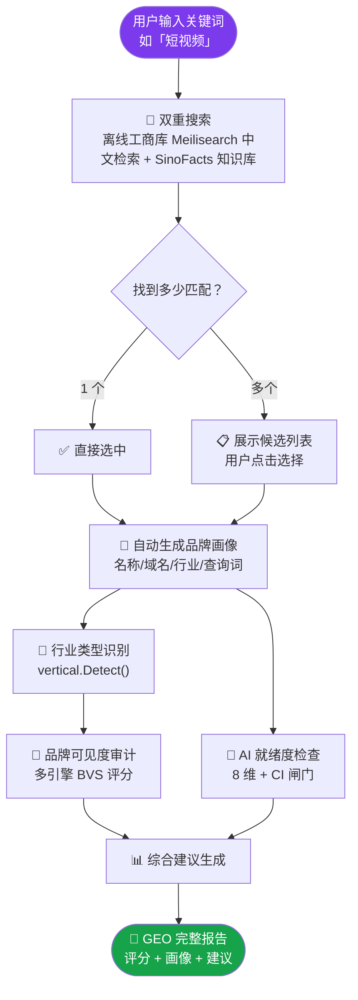

---

## 🔌 API 接口地图

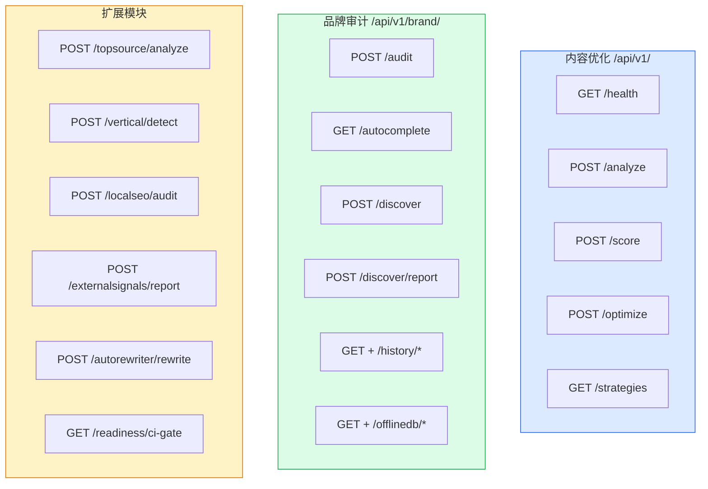

<details><summary>📋 完整 API 列表（点击展开）</summary>

| 方法 | 路径 | 说明 |
|---|---|---|
| GET | `/api/v1/health` | 健康检查 |
| GET | `/api/v1/strategies` | 列出可用策略 |
| POST | `/api/v1/analyze` | 分析内容信号 |
| POST | `/api/v1/score` | GEO 评分 |
| POST | `/api/v1/optimize` | 优化内容 |
| POST | `/api/v1/brand/discover` | 关键词搜索匹配公司 |
| POST | `/api/v1/brand/discover/report` | 生成完整 GEO 报告 |
| GET | `/api/v1/brand/autocomplete` | 品牌智能补全 |
| POST | `/api/v1/brand/audit` | 品牌可见度审计 |
| GET | `/api/v1/brand/history/list` | 审计历史列表 |
| GET | `/api/v1/brand/history/stats` | 历史库统计 |
| GET | `/api/v1/brand/offlinedb/search` | 离线工商库搜索 |
| GET | `/api/v1/brand/offlinedb/stats` | 工商库统计 |
| POST | `/api/v1/brand/topsource/analyze` | Top Source 归因 |
| POST | `/api/v1/brand/vertical/detect` | 行业类型识别 |
| POST | `/api/v1/brand/localseo/audit` | Local SEO 审计 |
| POST | `/api/v1/autorewriter/rewrite` | AutoGEO 规则重写 |
| GET | `/api/v1/brand/readiness/ci-gate` | AI 就绪度 CI 闸门 |
| GET | `/api/v1/brand/compare` | 竞品对标矩阵 |
| GET | `/api/v1/brand/compare/export` | 竞品对比报告导出（HTML/JSON） |
| GET | `/api/v1/brand/profile/autocomplete` | 品牌画像自动补全 |
| GET | `/api/v1/leaderboard` | GEO 公开排行榜 |
| GET | `/api/v1/leaderboard/categories` | 排行榜类目列表 |
| GET | `/api/v1/cms/check` | CMS 内容 GEO 检查 |
| GET | `/api/v1/cms/info` | CMS 插件信息 |
| GET | `/api/v1/meta/whitelabel` | 白标配置 |
| GET | `/api/v1/security/audit` | 安全审计信息 |
| GET | `/api/v1/admin/tenants` | 管理员-租户列表 |
| GET | `/api/v1/admin/usage` | 管理员-用量统计 |
| GET | `/api/v1/admin/system` | 管理员-系统信息 |
| GET/POST | `/api/v1/admin/announcements` | 管理员-公告管理 |
| GET | `/api/v1/help/articles` | 帮助文章列表 |
| GET | `/api/v1/help/onboarding` | 新手引导步骤 |
| GET/POST | `/api/v1/tickets` | 工单创建/列表 |
| GET | `/api/v1/pricing/plans` | 定价方案列表 |
| GET | `/api/v1/landing/features` | 功能亮点 |
| GET | `/api/v1/landing/stats` | 平台统计 |

</details>

---

## 📁 项目结构

```mermaid
tree
    root[my-geo/]
    ├── 📂 cmd/geo/ ["Web 服务入口（无子命令，启动即前端 + API）"]
    ├── 📂 pkg/geo/ ["公开 API 层"]
    ├── 📂 internal/
    │   ├── 📂 adapter/ ["13 AI 引擎适配器"]
    │   ├── 📂 brand/ ["品牌可见度"]
    │   │   ├── 📂 chinacheck/ ["CC MCP + 缓存"]
    │   │   ├── 📂 discover/ ["关键词发现"]
    │   │   ├── 📂 history/ ["审计历史存储"]
    │   │   ├── 📂 knowledge/ ["知识库"]
    │   │   ├── 📂 offlinedb/ ["工商库"]
    │   │   ├── 📂 readiness/ ["就绪度"]
    │   │   ├── 📂 scheduler/ ["调度器"]
    │   │   ├── 📂 topsource/ ["TopSource"]
    │   │   ├── 📂 vertical/ ["行业识别"]
    │   │   └── 📂 report/ ["HTML 报告"]
    │   ├── 📂 config/ ["环境变量 + 预设"]
    │   ├── 📂 dbprovider/ ["数据库工厂层"]
    │   ├── 📂 llm/ ["LLM 管理器"]
    │   ├── 📂 optimizer/ ["9法策略 + AutoGEO"]
    │   ├── 📂 scorer/ ["评分器"]
    │   └── 📂 server/ ["REST API + go:embed 前端（构建产物来自 web-app/）"]
    ├── 📂 web-app/ ["前端 SPA (Vite + React + TS)"]
    │   ├── 📂 src/pages/ ["10+ 页面组件"]
    │   ├── 📂 src/components/ ["UI 组件库"]
    │   ├── 📂 src/services/ ["API 客户端"]
    │   └── 📂 src/i18n/ ["国际化 ZH/EN/JA"]
    ├── 📂 integrations/ ["第三方集成"]
    │   ├── 📂 chrome-extension/ ["Chrome MV3 扩展"]
    │   ├── 📂 wordpress/ ["WordPress 插件"]
    │   └── 📂 shopify/ ["Shopify 插件"]
    ├── 📂 scripts/ ["运行部署脚本"]
    ├── 📂 .github/workflows/ ["CI + Release"]
    ├── 📂 docs/ ["架构 + 入门文档"]
    ├── Dockerfile
    ├── Makefile
    └── .env.example
```

---

## 🔧 设计决策

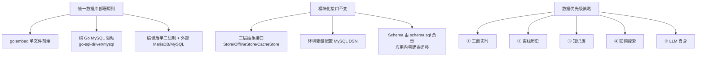

---

## 🚦 CI/CD

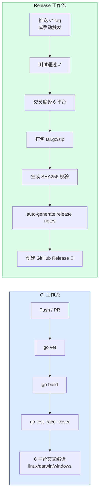

```bash
# 发布新版本
git tag v0.1.0
git push origin v0.1.0
```

| OS | amd64 | arm64 |
|---|---|---|
| Linux | tar.gz | tar.gz |
| macOS | tar.gz | tar.gz (Apple Silicon) |
| Windows | zip | zip |

---

## 📚 学术参考

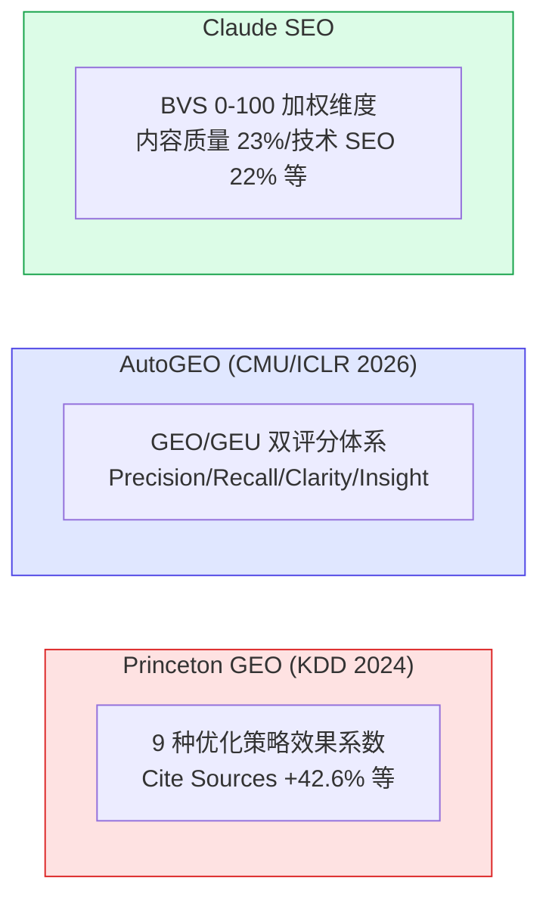

---

## 📜 许可证

**MIT License** — 自由使用、修改、分发。
