# GEO 系统架构文档

## 1. 系统全景

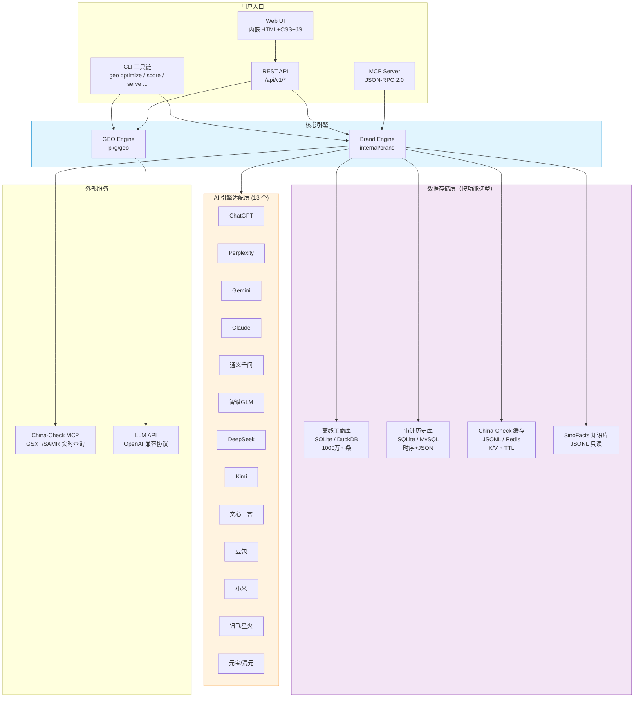

## 2. 内容优化流程

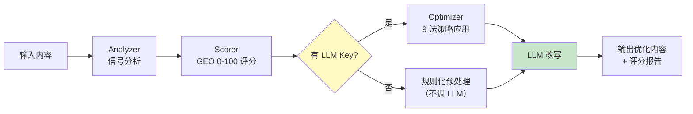

### GEO 评分维度

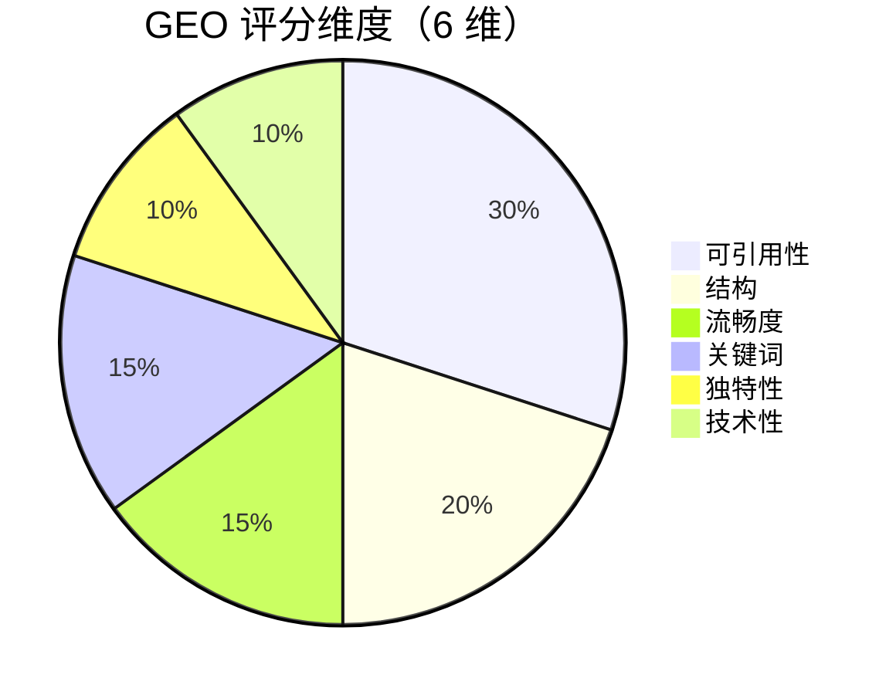

### 9 法策略效果（Princeton 论文基准）

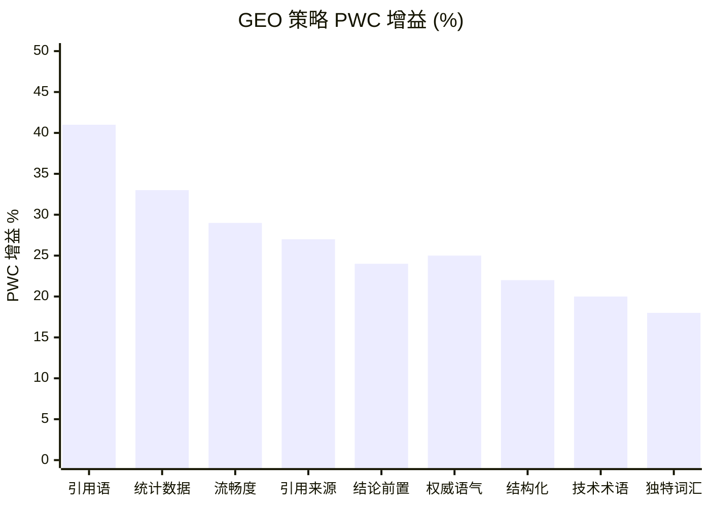

## 3. 品牌可见度审计流程

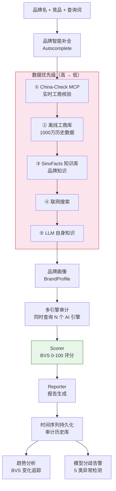

### BVS 加权健康评分维度

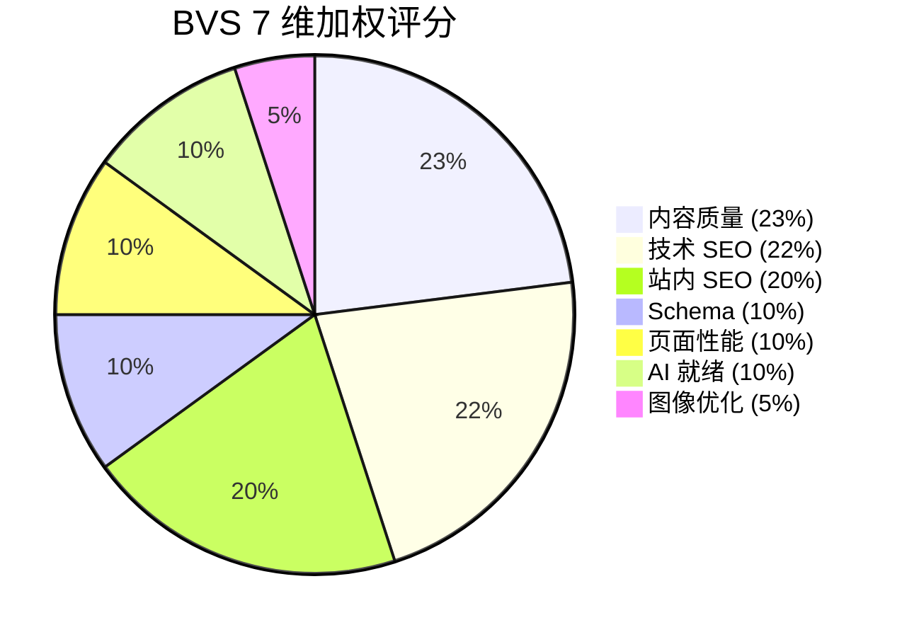

### 5 类模型分歧告警

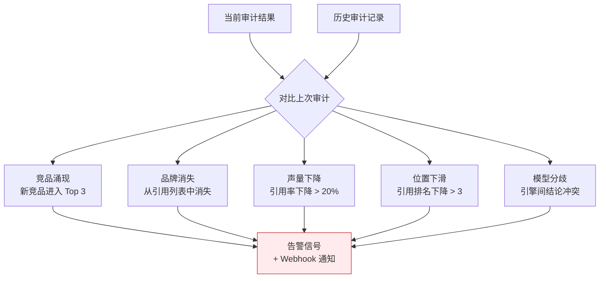

## 4. 数据库选型架构

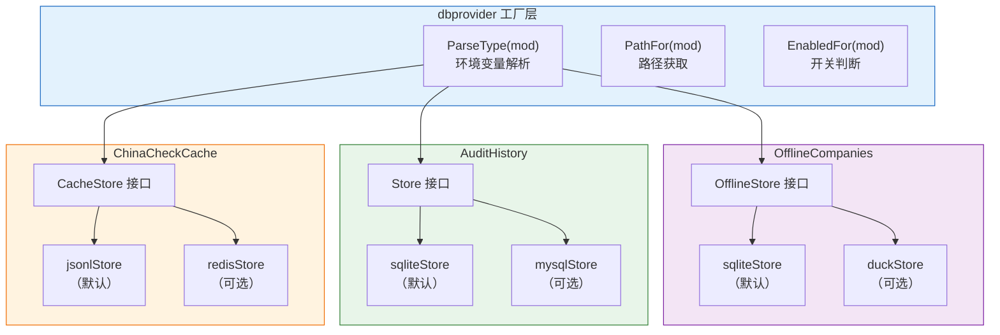

### 数据库选型决策表

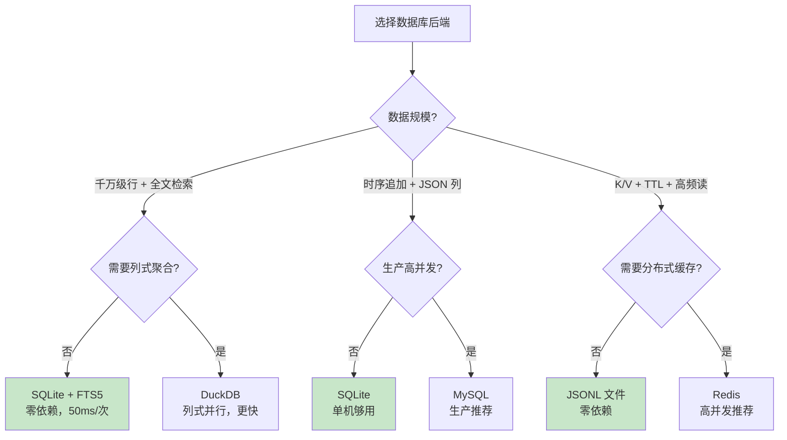

## 5. AI 引擎适配层

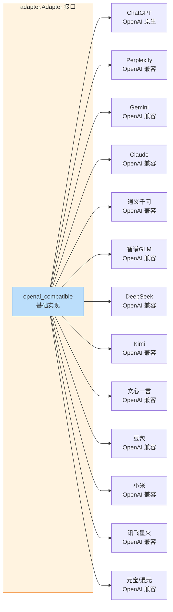

### 引擎预设权重对比

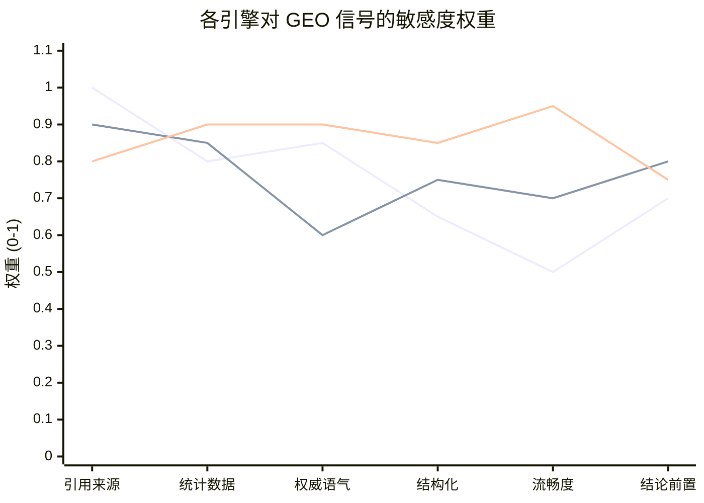

## 6. 工商数据导入流程

```mermaid
flowchart TB
    A["JSON 文件<br/>guichong/-/tree/json"] --> B{"格式探测<br/>detectJSONFormat"}

    B -->|"[" 开头"| C["JSON 数组<br/>importJSONArray<br/>Token 流式处理"]
    B -->|"{" 含数组键"| D["对象包裹数组<br/>importJSONObject<br/>{erDataList: [...]}"]
    B -->|"{" 逐行"| E["JSONL<br/>importJSONL<br/>逐行扫描"]

    C & D & E --> F["mapRec<br/>字段映射<br/>（中文 key / 英文 key 兼容）"]
    F --> G["批量 INSERT<br/>事务 2000 条/批"]
    G --> H["INSERT OR IGNORE<br/>信用代码去重"]
    H --> I["FTS5 触发器<br/>自动同步索引"]

    style B fill:#fff9c4
    style G fill:#c8e6c9
    style I fill:#e1f5fe
```

## 7. 定时审计调度器

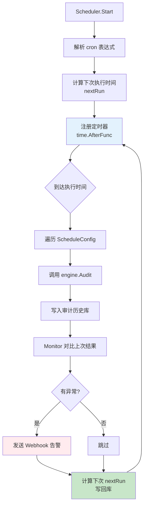

## 8. MCP Server 架构

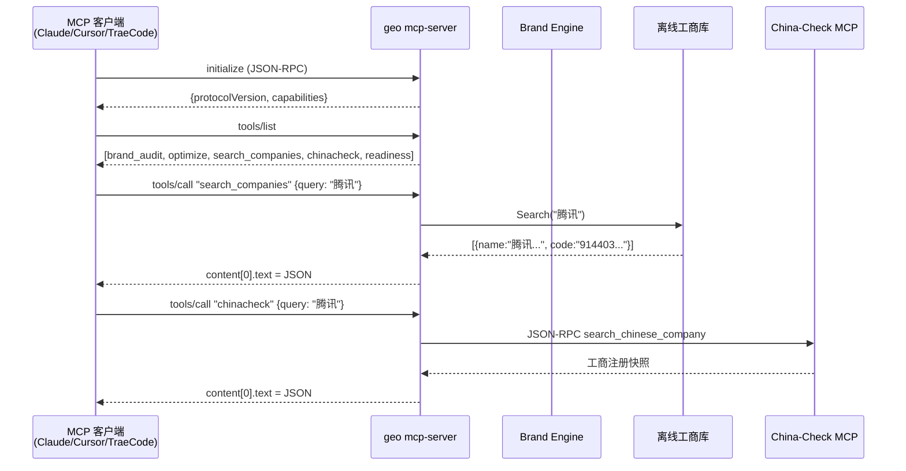

## 9. 部署架构

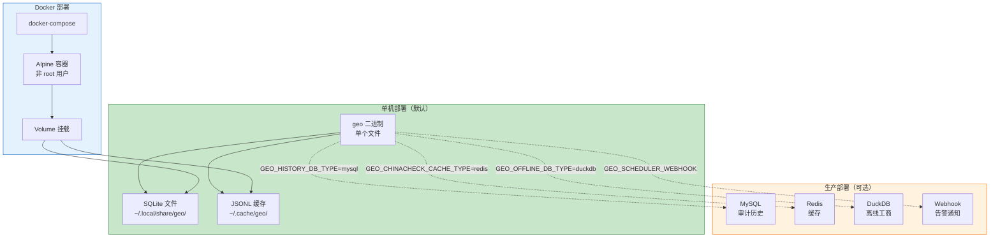

## 10. 环境变量全景

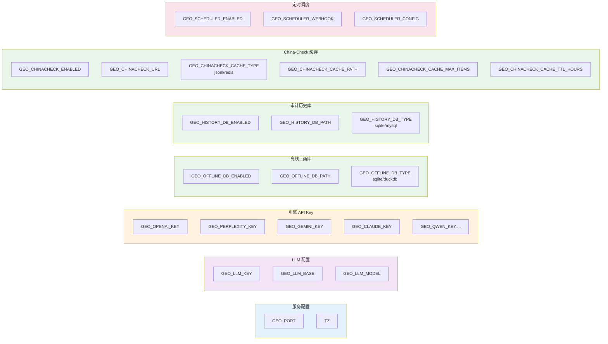
