# 🏗 GEO 系统架构文档

> 本文档以 Mermaid 图表为主、文字为辅，全面解析 GEO 系统的架构设计。

---

## 目录

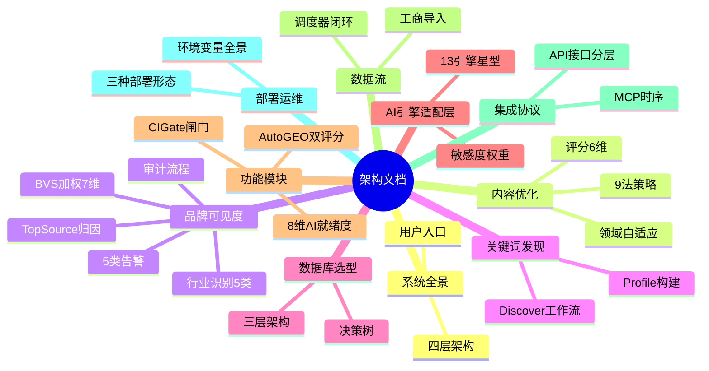

---

## 1. 系统全景架构

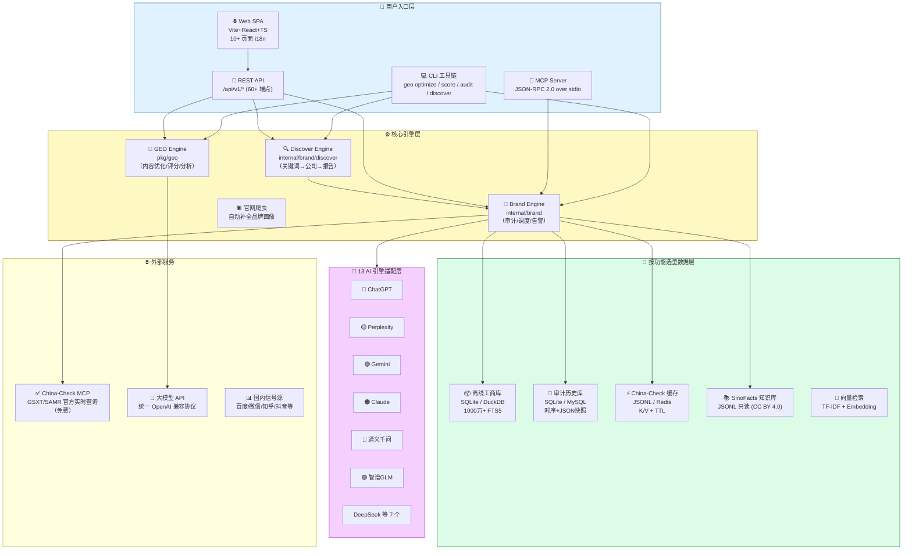

### 四种用户入口对比

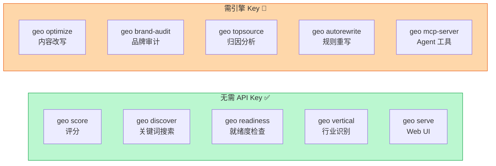

---

## 2. 内容优化引擎

### 优化流程

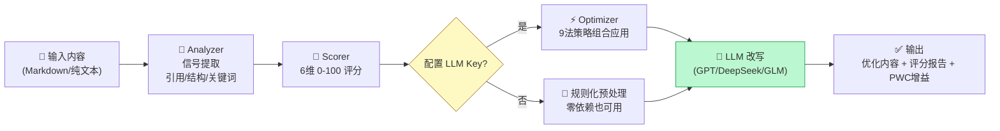

### GEO 6 维评分饼图

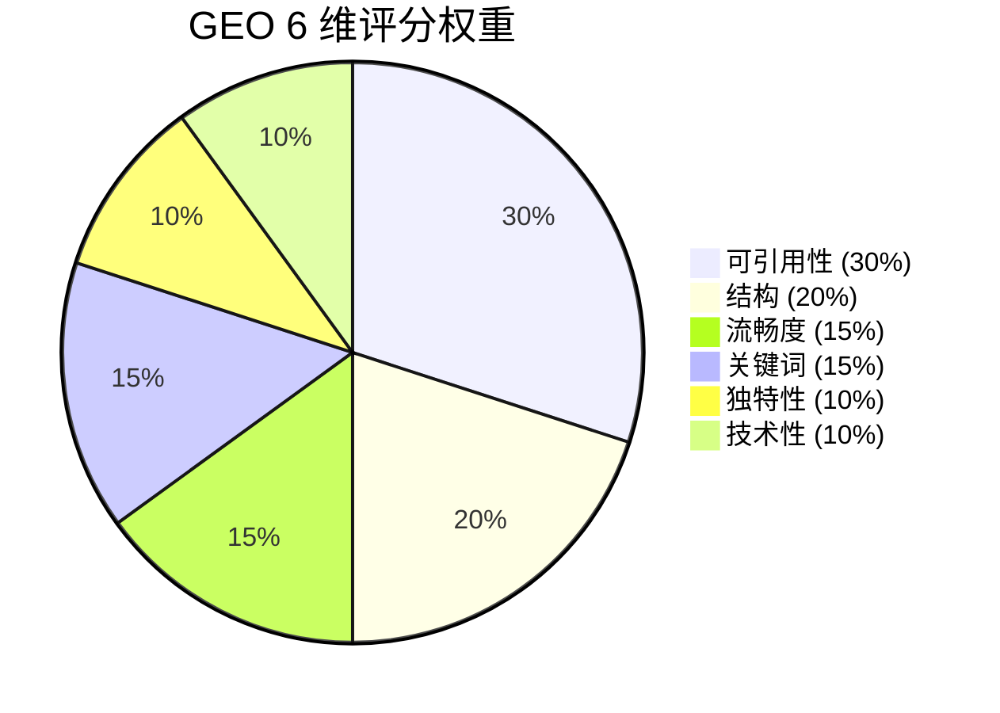

### 9 法策略 PWC 增益（Princeton KDD 2024 实测）

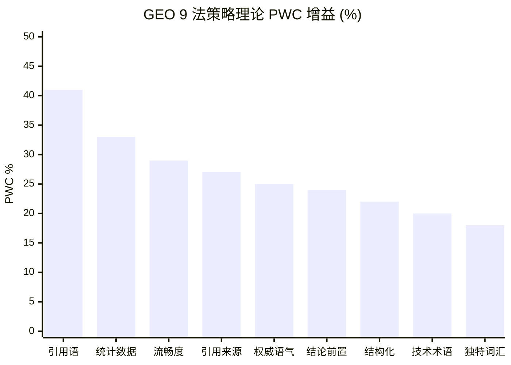

### 三大领域自适应策略

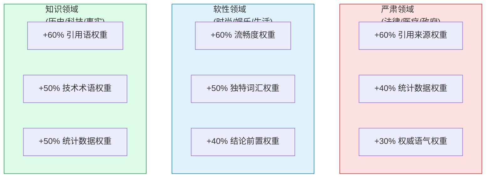

---

## 3. 品牌可见度引擎

### 完整审计流程

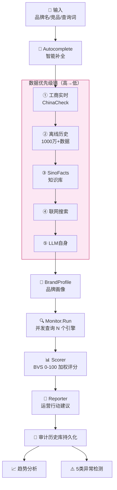

### BVS 7 维加权评分（参考 Claude SEO）

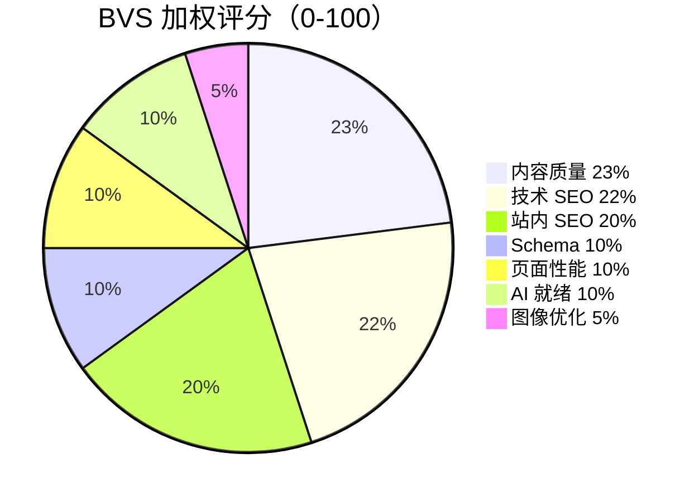

### 5 类模型分歧告警决策流

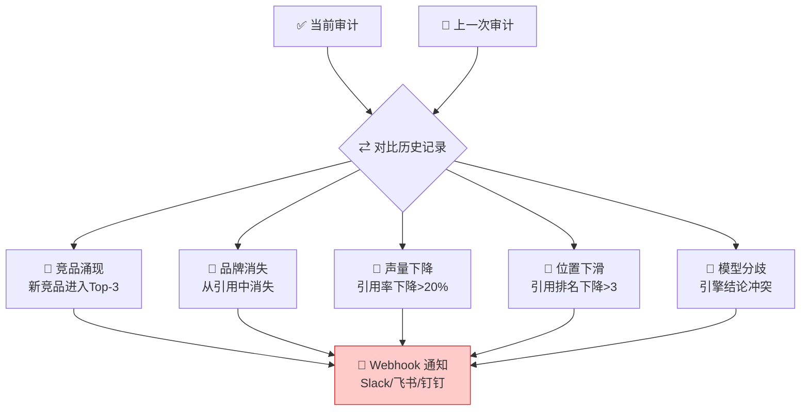

### 行业类型识别（5 类垂直）

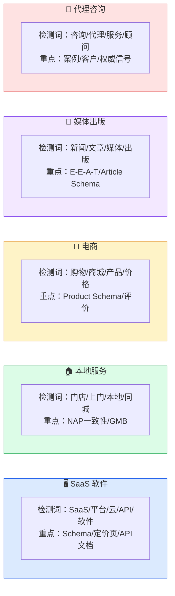

### Top Source 归因流程图

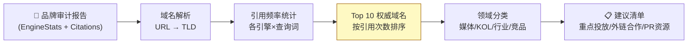

### 竞品引用差距热力图矩阵（引擎 × 查询词）

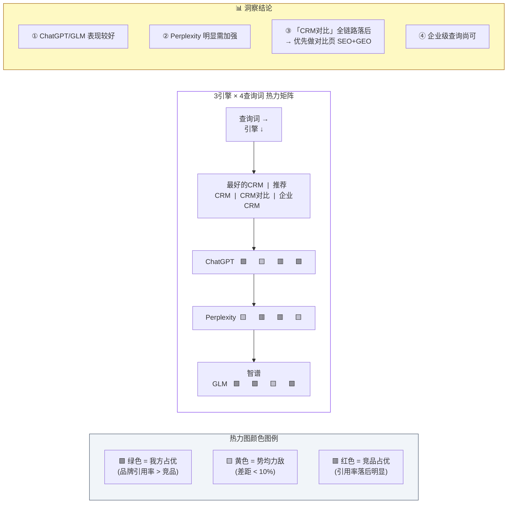

### 审计报告内部结构

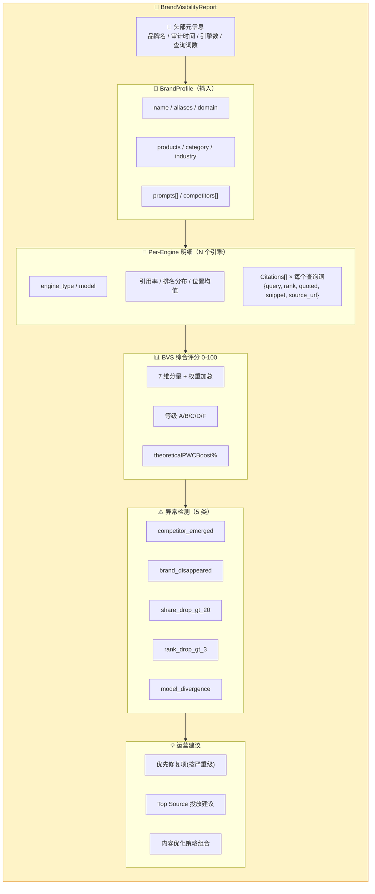

### Autocomplete 多来源融合流程

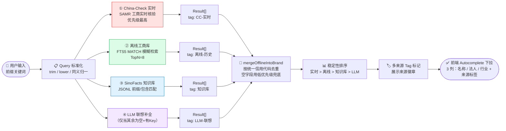

### UI 响应捕获（双模式：API + Playwright UI）

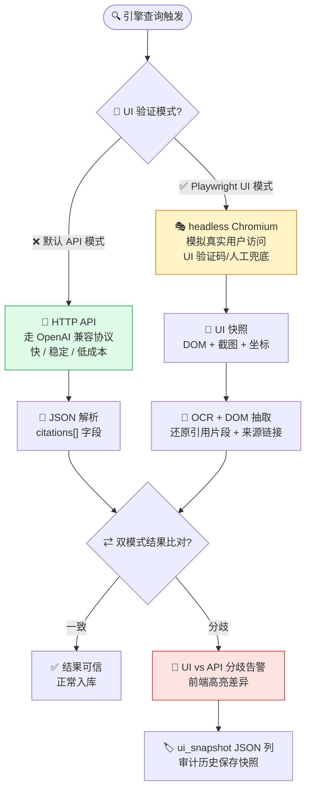

---

## 4. 关键词发现引擎（Discover）

### 完整工作流

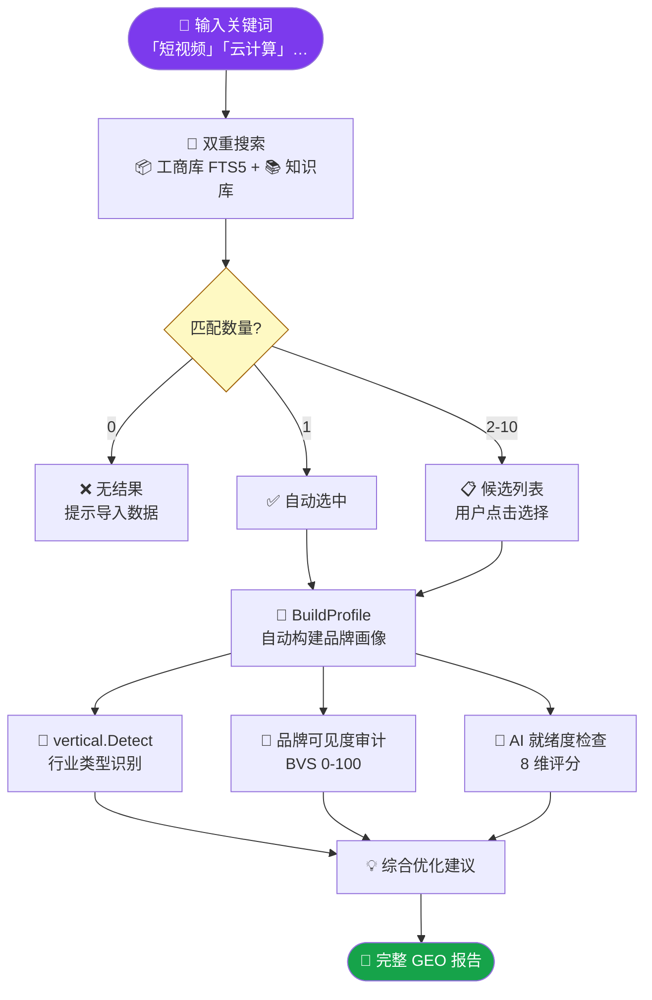

### 品牌画像自动构建逻辑

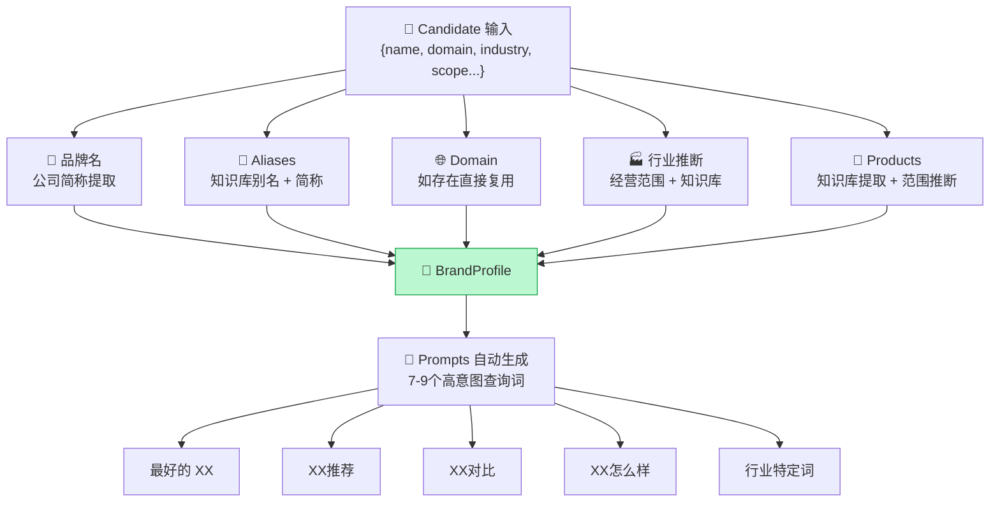

---

## 5. 数据库选型架构

### 三层抽象架构

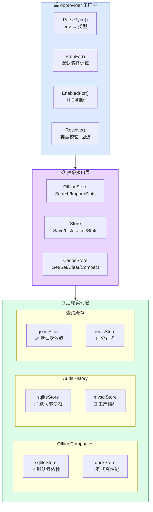

### 数据库选型决策树

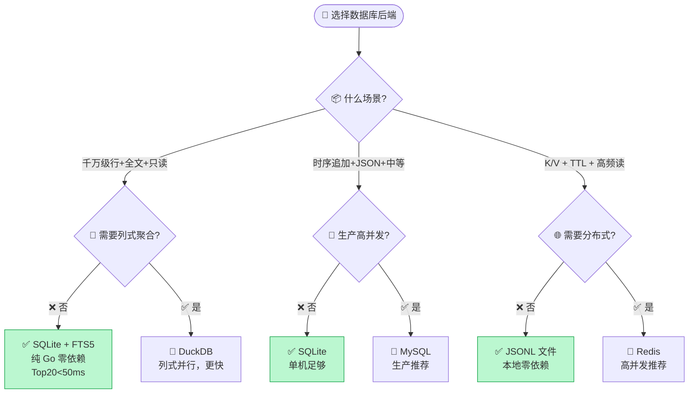

---

## 6. AI 引擎适配层

### 13 引擎星型结构（共用 OpenAI 兼容基类）

```mermaid
graph TD
    B["🔵 openai_compatible<br/>公共基类<br/>（发送请求 / 解析响应 / Token计算）"]

    B --> E1["ChatGPT"]
    B --> E2["Perplexity"]
    B --> E3["Gemini"]
    B --> E4["Claude"]
    B --> E5["通义千问"]
    B --> E6["智谱GLM"]
    B --> E7["DeepSeek"]
    B --> E8["Kimi"]
    B --> E9["文心一言"]
    B --> E10["豆包"]
    B --> E11["小米"]
    B --> E12["讯飞星火"]
    B --> E13["元宝/混元"]

    style B fill:#bfdbfe,stroke:#1d4ed8
```

### 各引擎对 GEO 信号敏感度权重对比

```mermaid
xychart-beta
    title "各引擎 GEO 信号敏感度（越高越重视）"
    x-axis ["引用来源", "统计数据", "权威语气", "结构化", "流畅度", "结论前置"]
    y-axis "权重 (0-1)" 0 --> 1.1
    line [1.00, 0.80, 0.85, 0.65, 0.50, 0.70]
    line [0.90, 0.85, 0.60, 0.75, 0.70, 0.80]
    line [0.80, 0.90, 0.90, 0.85, 0.95, 0.75]
```

> 蓝线=搜索增强型(Perplexity)，橙线=对话型(ChatGPT)，绿线=学术型(智谱GLM)

---

## 7. 核心高级功能

### AutoGEO 规则提取 + GEU 双评分

```mermaid
flowchart LR
    A["🧩 多条优化前后对比样本"] --> B["📐 规则提取器<br/>统计高频改写模式"]
    B --> RULES["📜 偏好规则库<br/>按引擎分类归档"]

    RULES --> C["✍️ 双模式重写<br/>API LLM / 本地微调"]
    C --> D["✅ 生成内容"]

    D --> GEO["📊 GEO 评分<br/>可见度指标"]
    D --> GEU["🎯 GEU 效用检查<br/>Precision/Recall/Clarity/Insight"]

    GEO --> PASS{"均不降级?"}
    GEU --> PASS
    PASS -->|"✅ 是"| OUT["👍 采纳新内容"]
    PASS -->|"❌ 否"| REJ["👎 回滚保留旧版"]

    style PASS fill:#fef9c3,stroke:#a16207
```

### 8 维 AI 就绪度检查

```mermaid
flowchart TB
    URL["🌐 网站 URL"] --> T1["🤖 robots.txt<br/>AI 爬虫屏蔽?(Critical)"]
    URL --> T2["📋 llms.txt<br/>LLM 摘要文件?(High)"]
    URL --> T3["🏷 结构化数据<br/>JSON-LD Schema?(High)"]
    URL --> T4["🗺 sitemap.xml<br/>站点地图?(Medium)"]
    URL --> T5["⏱ 页面性能<br/>TTFB < 600ms?(Medium)"]
    URL --> T6["📑 H1 标题<br/>唯一+层级清晰?(Medium)"]
    URL --> T7["❓ FAQ 质量<br/>FAQPage Schema?(Low)"]
    URL --> T8["👤 实体身份<br/>Organization Schema?(Low)"]

    T1 & T2 & T3 & T4 & T5 & T6 & T7 & T8 --> SC["📊 0-100 综合评分<br/>+ 等级(A-F)"]
    SC --> CI{"🚧 CI Gate?<br/>--ci-gate 80"}
    CI -->|"✅ ≥80"| OK["✅ 流水线通过"]
    CI -->|"❌ <80"| FAIL["❌ exit 1 阻断"]

    style T1 fill:#fecaca,stroke:#dc2626
    style FAIL fill:#fecaca,stroke:#dc2626
```

### BVS 等级分布 + 建议行动

```mermaid
graph LR
    subgraph A ["🟢 A 90-100"]
        A1["行动：持续监测 + 定期复查"]
    end
    subgraph B ["🔵 B 80-89"]
        B1["行动：补强薄弱维度"]
    end
    subgraph C ["🟡 C 70-79"]
        C1["行动：重点优化结构化 + Schema"]
    end
    subgraph D ["🟠 D 60-69"]
        D1["行动：全面审计整改"]
    end
    subgraph F ["🔴 F 0-59"]
        F1["行动：紧急阻断索引 + 深度优化"]
    end

    style A fill:#bbf7d0,stroke:#16a34a
    style B fill:#bfdbfe,stroke:#2563eb
    style C fill:#fef08a,stroke:#ca8a04
    style D fill:#fed7aa,stroke:#ea580c
    style F fill:#fecaca,stroke:#dc2626
```

---

## 8. 核心数据流

### 工商数据导入流程

```mermaid
flowchart TB
    FILES["📁 JSON 源文件<br/>guichong/-/tree/json<br/>按省/年分目录"] --> FORMAT{"🔍 格式探测<br/>detectJSONFormat()"}

    FORMAT -->|"'['开头"| ARR["🧾 JSON 数组<br/>decoder.Token流式"]
    FORMAT -->|"Object含数组"| OBJ["📦 对象包裹数组<br/>{erDataList:[...]}"]
    FORMAT -->|"'{'逐行"| JSONL["📋 JSONL<br/>逐行扫描解析"]

    ARR & OBJ & JSONL --> MAP["🗺 mapRec<br/>字段映射(中/英key兼容)"]
    MAP --> TX["⚡ 事务批量 INSERT<br/>2000条/批"]
    TX --> DUP["🎯 INSERT OR IGNORE<br/>信用代码去重"]
    DUP --> FTS["🔎 FTS5 触发器<br/>自动同步全文索引"]

    style FORMAT fill:#fef9c3,stroke:#a16207
    style TX fill:#bbf7d0,stroke:#16a34a
```

### 定时审计调度器闭环

```mermaid
flowchart TB
    Start["⏰ Scheduler.Start"] --> Cron["📝 解析 cron 表达式<br/>默认：每 7 天"]
    Cron --> Next["📆 nextRun = 计算下次时间"]
    Next --> Wait["⌛ time.AfterFunc 注册定时器"]
    Wait --> Fire{"🚀 到达触发时间?"}
    Fire -- "是" --> Loop["🔁 遍历 ScheduleConfig 列表"]
    Loop --> Audit["🏢 engine.Audit(ctx, profile)"]
    Audit --> Save["💾 审计历史库写入"]
    Save --> Diff["📊 Monitor 对比上次结果"]
    Diff --> Warn{"⚠️ 触发异常信号?"}
    Warn -- "是" --> Hook["📨 Webhook 告警推送"]
    Warn -- "否" --> Cont["✅ 跳过告警"]
    Hook & Cont --> ReNext["📆 重新计算 nextRun"]
    ReNext --> Wait

    style Fire fill:#fef9c3,stroke:#a16207
    style Hook fill:#fecaca,stroke:#dc2626
```

---

## 9. 集成协议

### MCP Server 交互时序图

```mermaid
sequenceDiagram
    participant C as 🖥️ MCP 客户端<br/>Claude / Cursor / TraeCode
    participant S as 🧩 geo mcp-server
    participant BE as 🏢 Brand Engine
    participant DB as 📦 离线工商库
    participant CC as ✅ China-Check MCP

    C->>S: {method:initialize, id:1}
    S-->>C: {protocolVersion, tools capabilities}

    C->>S: {method:tools/list}
    S-->>C: [brand_audit, optimize, search_companies, chinacheck, readiness]

    Note over C,CC: 示例 1: 工商库搜索
    C->>S: tools/call "search_companies" {query:"腾讯"}
    S->>DB: Search("腾讯", TopN=5)
    DB-->>S: [5 条匹配记录]
    S-->>C: content=[{text:"JSON 数组"}]

    Note over C,CC: 示例 2: 实时工商核验
    C->>S: tools/call "chinacheck" {query:"腾讯"}
    S->>CC: JSON-RPC search_chinese_company
    CC-->>S: 官方最新工商快照
    S-->>C: content=[{text:"JSON 快照"}]

    Note over C,CC: 示例 3: 品牌审计
    C->>S: tools/call "brand_audit" {profile}
    S->>BE: engine.Audit(ctx, profile)
    BE-->>S: VisibilityReport + BVS Score
    S-->>C: content=[{text:"完整审计报告 JSON"}]
```

### REST API 分层路由

```mermaid
graph TB
    subgraph 入口层["🌐 入口层 /api/v1/"]
        H["health GET<br/>健康检查"]
        ST["strategies GET<br/>策略列表"]
    end

    subgraph 内容层["📝 内容优化 /api/v1/"]
        ANA["analyze POST<br/>信号分析"]
        SCO["score POST<br/>评分"]
        OPT["optimize POST<br/>优化改写"]
    end

    subgraph 品牌层["🏢 品牌审计 /api/v1/brand/"]
        ACD["discover POST"]
        ACR["discover/report POST"]
        AUD["audit POST<br/>品牌审计"]
        AUT["autocomplete GET<br/>补全"]
        REP["report/html GET<br/>HTML报告"]
    end

    subgraph 扩展层["🔥 P0/P1 扩展模块"]
        TS["topsource/analyze POST"]
        VR["vertical/detect POST"]
        LS["localseo/audit POST"]
        ES["externalsignals/report POST"]
        AR["autorewriter/* POST"]
        RD["readiness/ci-gate GET"]
    end

    subgraph 商业化["💼 商业化与交付 /api/v1/"]
        AD["admin/* GET/POST<br/>管理员后台"]
        TK["tickets GET/POST<br/>工单系统"]
        HP["help/* GET<br/>帮助中心"]
        PR["pricing/* GET<br/>定价方案"]
        LD["landing/* GET<br/>落地页"]
    end

    subgraph 安全["🛡 安全与白标 /api/v1/"]
        SE["security/audit GET<br/>安全审计"]
        WL["meta/whitelabel GET<br/>白标配置"]
    end

    subgraph 对标["📊 对标与排行 /api/v1/"]
        CP["brand/compare GET<br/>竞品对标"]
        LB["leaderboard GET<br/>GEO 排行榜"]
        CMS["cms/* GET/POST<br/>CMS 检查"]
    end

    style 入口层 fill:#ecfeff,stroke:#0891b2
    style 内容层 fill:#dbeafe,stroke:#1d4ed8
    style 品牌层 fill:#dcfce7,stroke:#15803d
    style 扩展层 fill:#fef3c7,stroke:#b45309
    style 商业化 fill:#e0e7ff,stroke:#4f46e5
    style 安全 fill:#fee2e2,stroke:#b91c1c
    style 对标 fill:#d1fae5,stroke:#047857
```

---

## 10. 部署与运维

### 三种部署形态

```mermaid
graph TB
    subgraph 单机["🟢 单机部署（推荐个人）"]
        direction LR
        BIN["📦 geo 二进制<br/>含 SPA 前端 + 降级缓存"]
        BIN --> SQL["💿 SQLite 文件<br/>~/.local/share/geo/"]
        BIN --> JL["⚡ JSONL 缓存<br/>~/.cache/geo/"]
    end

    subgraph Docker["🔵 Docker 部署（推荐团队）"]
        DC["⚙️ docker-compose"]
        DC --> C["🐳 Alpine 容器<br/>非root用户"]
        C --> V["💾 Volume 挂载<br/>持久化数据"]
        V --> SQL2["💿 SQLite + JSONL"]
    end

    subgraph 生产["🟠 生产部署（大规模）"]
        direction LR
        BIN2["🛠 geo 二进制 / K8s Pods"]
        BIN2 --"GEO_HISTORY_DB_TYPE=mysql"--> MYSQL["🐬 MySQL 集群<br/>审计历史"]
        BIN2 --"GEO_CHINACHECK_CACHE_TYPE=redis"--> REDIS["🔴 Redis 哨兵<br/>缓存层"]
        BIN2 --"GEO_OFFLINE_DB_TYPE=duckdb"--> DUCK["🦆 DuckDB 挂载 SSD<br/>千万级数据"]
        BIN2 --"GEO_SCHEDULER_WEBHOOK"--> WEB["📨 Webhook<br/>告警到飞书/钉钉"]
    end

    style 单机 fill:#bbf7d0,stroke:#16a34a
    style Docker fill:#bfdbfe,stroke:#2563eb
    style 生产 fill:#fed7aa,stroke:#ea580c
```

### 环境变量分组全景

```mermaid
graph LR
    subgraph 基础["🟦 服务基础"]
        PORT["GEO_PORT=8080"]
    end

    subgraph LLM["🟣 LLM 配置"]
        K["GEO_LLM_KEY"]
        B["GEO_LLM_BASE"]
        M["GEO_LLM_MODEL"]
    end

    subgraph Engines["🟠 引擎 Keys ×13"]
        K1["GEO_OPENAI_KEY"]
        K2["GEO_GLM_KEY"]
        K3["GEO_DEEPSEEK_KEY"]
        K4["GEO_QWEN_KEY 等..."]
    end

    subgraph DBs["🟢 数据库 ×3 模块"]
        OT["GEO_OFFLINE_DB_TYPE<br/>sqlite/duckdb"]
        HT["GEO_HISTORY_DB_TYPE<br/>sqlite/mysql"]
        CT["GEO_CHINACHECK_CACHE_TYPE<br/>jsonl/redis"]
    end

    subgraph 调度["🔴 定时调度"]
        SE["GEO_SCHEDULER_ENABLED=true"]
        WK["GEO_SCHEDULER_WEBHOOK=xxx"]
    end

    subgraph 安全白标["🛡 安全与白标"]
        AK["GEO_API_KEY"]
        ADM["GEO_ADMIN_KEY"]
        CO["GEO_CORS_ORIGINS"]
        RL["GEO_RATE_LIMIT_GLOBAL"]
        WB["GEO_WHITELABEL_BRAND_NAME"]
        WC["GEO_WHITELABEL_PRIMARY_COLOR"]
    end

    subgraph 国内信号["📊 国内信号源"]
        BI["GEO_BAIDU_INDEX_KEY"]
        WI["GEO_WECHAT_INDEX_KEY"]
        ZH["GEO_ZHIHU_HOT_KEY"]
        XH["GEO_XHS_KEY"]
        DY["GEO_DOUYIN_OCEAN_KEY"]
        NW["GEO_NEWSWIRE_KEY"]
        CR["GEO_CRM_KEY"]
    end

    style 基础 fill:#e0f2fe,stroke:#0369a1
    style LLM fill:#f3e8ff,stroke:#7c3aed
    style Engines fill:#fed7aa,stroke:#ea580c
    style DBs fill:#dcfce7,stroke:#16a34a
    style 调度 fill:#fee2e2,stroke:#dc2626
    style 安全白标 fill:#ede9fe,stroke:#6d28d9
    style 国内信号 fill:#dbeafe,stroke:#1d4ed8
```

---

## 图表清单

本架构文档共计 **31** 张 Mermaid 图表：

| # | 类型 | 章节 | 说明 |
|---|---|---|---|
| 1 | mindmap | 目录 | 文档内容导航 mindmap |
| 2 | graph TB | 1.系统全景 | 四层架构图（用户→引擎→AI→数据→外部） |
| 3 | graph LR | 1.系统全景 | 四种入口对比（需Key/零配置） |
| 4 | flowchart LR | 2.内容优化 | 内容优化 6 步流程 |
| 5 | pie | 2.内容优化 | GEO 6 维评分权重饼图 |
| 6 | xychart-beta | 2.内容优化 | 9 法策略 PWC 增益柱状图 |
| 7 | graph TB | 2.内容优化 | 三大领域自适应策略 |
| 8 | flowchart TB | 3.品牌可见度 | 完整审计流程+数据优先级链 |
| 9 | pie | 3.品牌可见度 | BVS 7 维加权评分饼图 |
| 10 | flowchart TD | 3.品牌可见度 | 5 类模型分歧告警决策流 |
| 11 | graph LR | 3.品牌可见度 | 5 类行业垂直识别 |
| 12 | flowchart LR | 3.品牌可见度 | Top Source 归因流程 |
| 13 | graph LR | 3.品牌可见度 | **竞品引用差距热力图矩阵**（新） |
| 14 | graph TB | 3.品牌可见度 | **审计报告内部结构**（新） |
| 15 | flowchart LR | 3.品牌可见度 | **Autocomplete 多来源融合流程**（新） |
| 16 | flowchart TB | 3.品牌可见度 | **UI 双模式响应捕获（API + Playwright）**（新） |
| 17 | flowchart TD | 4.关键词发现 | Discover 完整工作流 |
| 18 | graph TB | 4.关键词发现 | BrandProfile 自动构建逻辑 |
| 19 | graph TB | 5.数据库选型 | 三层抽象架构（工厂→接口→实现） |
| 20 | flowchart TD | 5.数据库选型 | 选型决策树 |
| 21 | graph TD | 6.AI适配层 | 13 引擎星型结构（共用基类） |
| 22 | xychart-beta | 6.AI适配层 | 引擎敏感度权重折线对比 |
| 23 | flowchart LR | 7.高级功能 | AutoGEO 规则提取 + GEU 双评分 |
| 24 | flowchart TB | 7.高级功能 | 8 维 AI 就绪度 + CI 闸门 |
| 25 | graph LR | 7.高级功能 | BVS 等级分层与行动指南 |
| 26 | flowchart TB | 8.数据流 | 工商数据导入流程（3种格式+批量事务） |
| 27 | flowchart TB | 8.数据流 | 定时审计调度器闭环（Cron+告警） |
| 28 | sequenceDiagram | 9.集成协议 | MCP Server 完整交互时序 |
| 29 | graph TB | 9.集成协议 | REST API 四层路由 |
| 30 | graph TB | 10.部署运维 | 三种部署形态（单机/Docker/生产） |
| 31 | graph LR | 10.部署运维 | 环境变量分组全景（5 大类） |
