# 📘 GEO 入门指南

> 从零开始了解 GEO（生成式引擎优化），并学会使用本项目提升内容在 AI 搜索引擎中的可见度。

---

## 🗺 文档导览

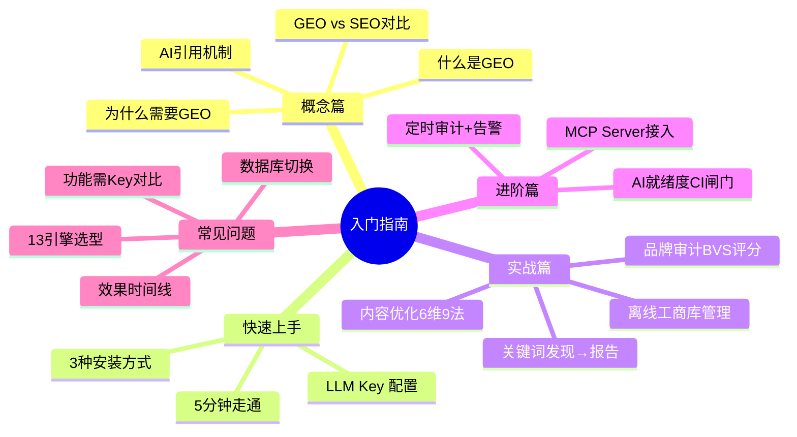

| 章节 | 你会学到 | Mermaid 图表 |
|---|---|---|
| 🎓 概念篇 | GEO 是什么？为什么现在必须做？ | 5 张 |
| ⚡ 快速上手 | 安装→配置→跑通全流程 | 4 张 |
| 🛠 实战篇 | 内容优化+品牌审计+工商库 | 8 张 |
| 🚀 进阶篇 | CI 闸门+定时审计+MCP | 4 张 |
| ❓ FAQ | 常见问题+引擎选型决策 | 3 张 |

---

## 什么是 GEO？

**GEO**（Generative Engine Optimization，生成式引擎优化）是让内容更容易被 AI 搜索引擎**引用**的优化方法。

当用户向 ChatGPT、Perplexity、Gemini、Claude、通义千问等 AI 助手提问时，AI 会从海量内容中**选择并引用**部分来源。GEO 的目标是让你的内容成为 AI 的"首选引用源"。

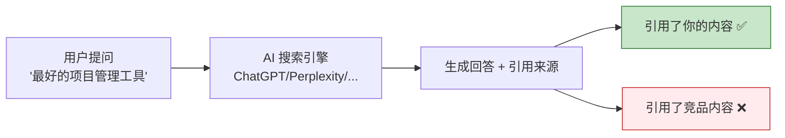

### AI 引用内容的机制

AI 搜索引擎生成回答时，会经历三个阶段：

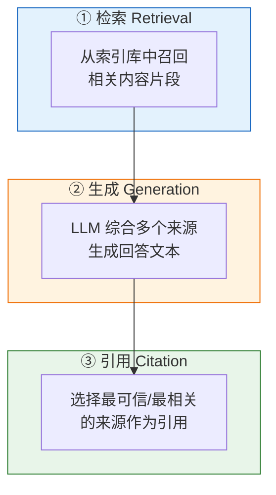

GEO 优化的核心就是：**让你的内容在以上三个阶段都更容易被选中。**

---

## 为什么需要 GEO？

### 用户搜索习惯正在改变

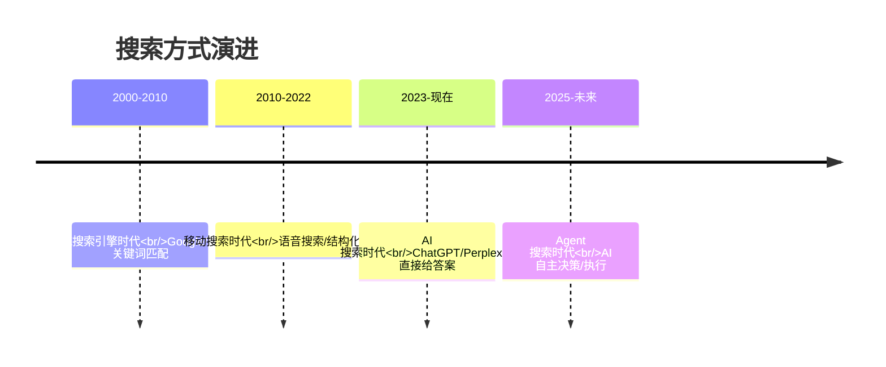

### 传统 SEO 正在失效

| 维度 | 传统 SEO | AI 搜索时代 |
|---|---|---|
| 用户行为 | 输入关键词 → 翻页点击 | 提问 → 直接看答案 |
| 排名位置 | 10 个蓝色链接 | AI 生成的 1 个答案 |
| 流量来源 | 搜索结果页点击 | AI 回答中的引用 |
| 优化目标 | 排名靠前 | 被 AI 引用 |
| 内容形式 | 关键词堆砌 | 结构化、可引用的内容 |

### 数据说话

Princeton 大学 KDD 2024 论文实测了 9 种 GEO 策略的效果：

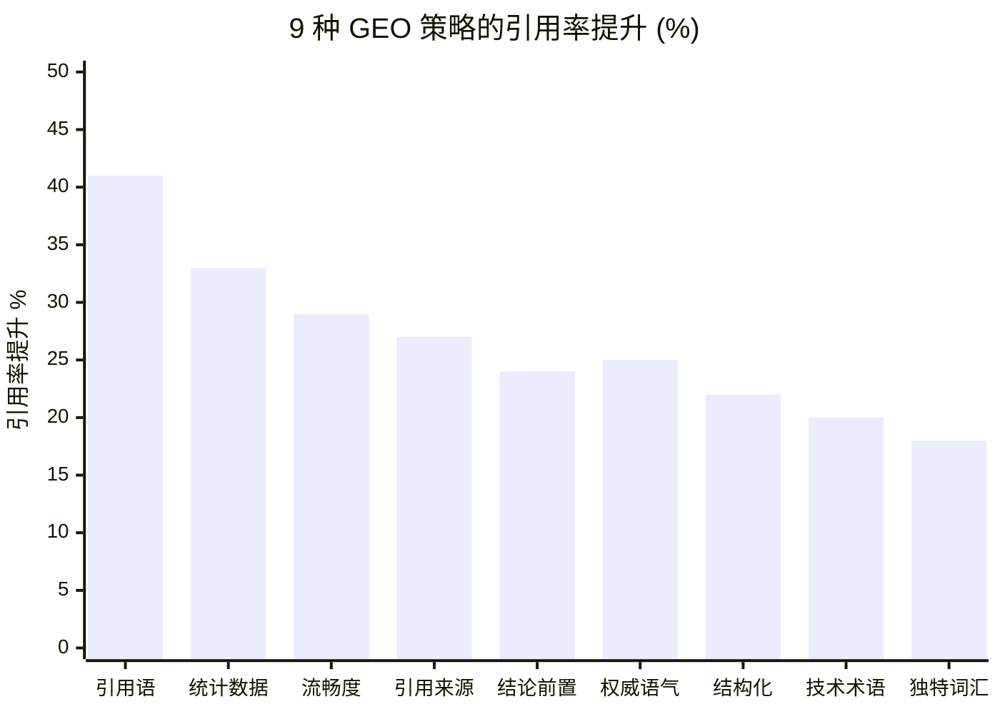

> **关键发现**：仅仅添加权威引用语就能提升 41% 的被引用概率！

---

## GEO vs SEO：有什么不同？

### 关注点对比图

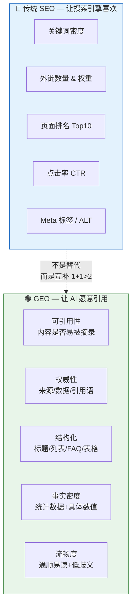

### SEO vs GEO 六维雷达对比

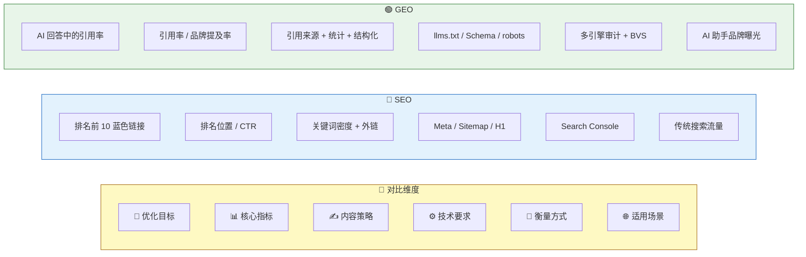

> **核心建议**：SEO 和 GEO **同时做**。SEO 守住传统搜索流量基本盘，GEO 抢占 AI 搜索新流量红利。

---

## 本项目能做什么？

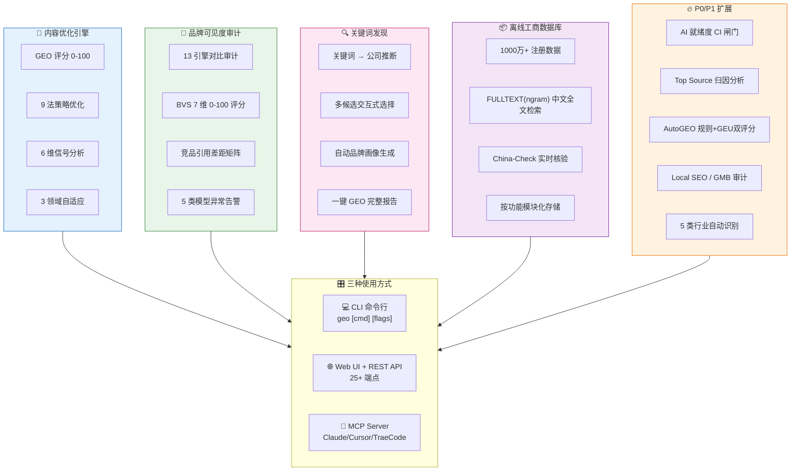

---

## ⚡ 5 分钟快速开始

### 总览流程图

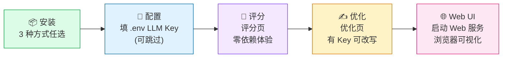

### 第一步：安装（3 种方式对比）

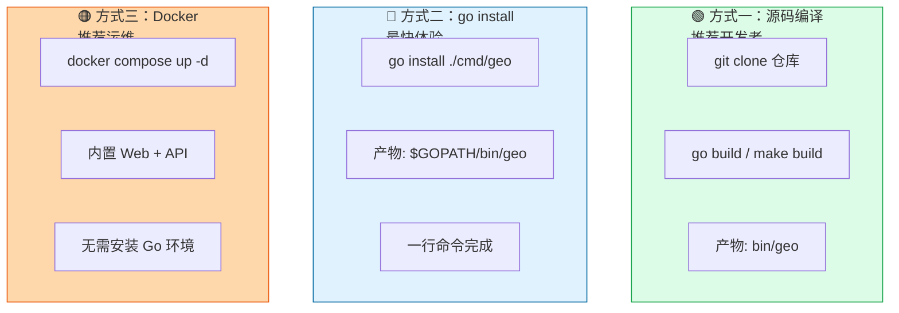

```bash
# 方式一：从源码编译（需要 Go 1.26+）
git clone https://github.com/deep2code/geo.git
cd geo
make build        # 产物在 bin/geo

# 方式二：Go install
go install ./cmd/geo

# 方式三：Docker
docker compose up -d    # 访问 http://localhost:8080
```

### 第二步：配置 LLM（可选但推荐）

#### 🔑 引擎选型决策树

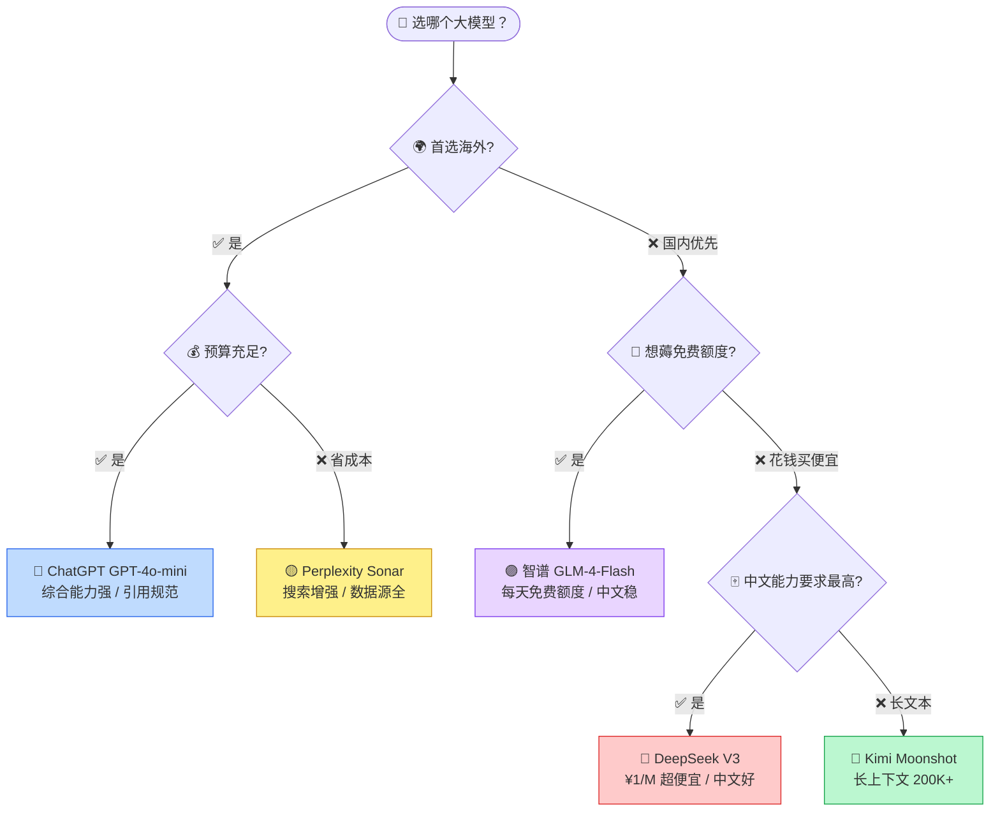

```bash
cp .env.example .env
```

编辑 `.env` 填入对应 Key（对应上面决策树的选择）：

```bash
# ── 🔵 ChatGPT ──
GEO_LLM_KEY=sk-xxx
GEO_LLM_MODEL=gpt-4o-mini

# ── 🔴 DeepSeek（便宜好用推荐）──
GEO_LLM_KEY=sk-xxx
GEO_LLM_BASE=https://api.deepseek.com
GEO_LLM_MODEL=deepseek-chat

# ── 🟣 智谱 GLM（有免费额度）──
GEO_LLM_KEY=xxx
GEO_LLM_BASE=https://open.bigmodel.cn/api/paas/v4
GEO_LLM_MODEL=glm-4-flash
```

> 💡 **不配置 LLM 也能用**：评分 / 分析 / 工商库查询 / 就绪度检查（部分功能）不需要 Key；优化改写与品牌审计需配置对应引擎 Key。

### 第三步：启动服务并给内容打分（零依赖体验）

```bash
./bin/geo                   # 直接启动 Web 服务（默认 :8080）
bash scripts/run.sh         # 脚本启动（杀旧进程+编译+后台）
open http://localhost:8080  # 浏览器打开
```

打开后在「内容优化」页粘贴：

```
Python 是一种广泛使用的编程语言。
```

点击「分析」即可看到类似评分（示例）：

```
GEO 评分: 42.3/100  等级: F
  CitabilitySignals   12.0 / 30  (40%)  ⚠️ 缺引用来源
  Structure            8.0 / 20  (40%)  ⚠️ 缺结构
  Fluency             13.0 / 15  (87%)  ✅ 流畅
```

### 第四步：优化内容（有 LLM Key 时）

在「内容优化」页填写内容并选择目标引擎（ChatGPT / Perplexity 等），点击「优化」即可由大模型改写并对比优化前后评分。无需命令行。

---

## 🛠 内容优化实战指南

### 🎯 评分等级条（一眼看懂）

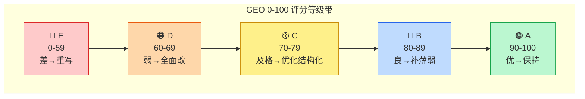

### 🧮 6 维评分详解

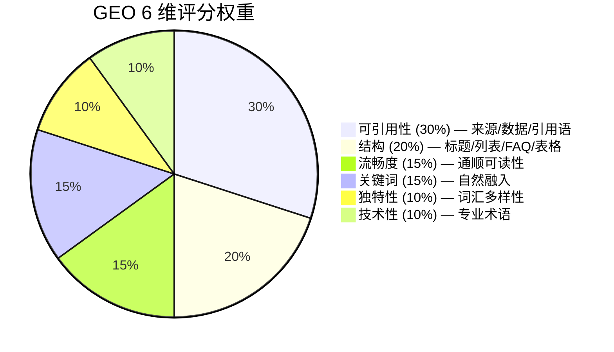

### ⚡ 9 法优化策略

#### 效果 × 实施成本 四象限矩阵

```mermaid
graph TB
    subgraph 低成本["💸 低成本（加几行文字）"]
        direction TB
        LC1["🟩 引用语 +41% ⭐TOP1<br/>加权威人物/机构的直接引语"]
        LC2["🟩 统计数据 +33%<br/>用具体数字替代模糊描述"]
        LC3["🟩 流畅度 +29%<br/>确保句子通顺连贯"]
        LC4["🟩 引用来源 +27%<br/>补充论断的可信来源"]
        LC5["🟩 结论前置 +24%<br/>核心答案放首段"]
    end

    subgraph 中成本["⚙️ 中成本（调整结构）"]
        direction TB
        MC1["🟨 权威语气 +25%<br/>'可能'→'研究表明'"]
        MC2["🟨 结构化 +22%<br/>加小标题/H2/表格/FAQ"]
    end

    subgraph 高成本["🧠 高成本（深度改写）"]
        direction TB
        HC1["🟧 技术术语 +20%<br/>补充专业术语密度"]
        HC2["🟧 独特词汇 +18%<br/>丰富多样性，避免重复"]
    end

    style 低成本 fill:#dcfce7,stroke:#16a34a
    style 中成本 fill:#fef08a,stroke:#ca8a04
    style 高成本 fill:#fed7aa,stroke:#ea580c
```

> **💡 新手建议**：从「低成本 + 高效果」的前 4 项入手（引用语 → 统计 → 流畅 → 来源），半天内就能把 F 级内容拉到 C 级。

以下是 Princeton 论文验证有效的 9 种策略，按效果从高到低排列：

#### 1. 引用语 (+41%) — 效果最佳

在内容中加入权威人物/机构的直接引用语。

```markdown
❌ 改进前：Python 是最流行的编程语言之一。

✅ 改进后：根据 TIOBE 2024 年度报告，Python 连续第五年位居编程语言排行榜第一。
          TIOBE 创始人 Paul Jansen 表示："Python 的增长势头前所未见。"
```

#### 2. 统计数据 (+33%)

用具体数字替代模糊描述。

```markdown
❌ 改进前：很多人使用 Python。

✅ 改进后：根据 Stack Overflow 2024 开发者调查，Python 拥有 51.2% 的使用率，
          全球开发者超过 1700 万。
```

#### 3. 流畅度 (+29%)

确保内容通顺易读，AI 更倾向引用流畅的内容。

```markdown
❌ 改进前：Python。简单。易学。很多库。数据分析好用。机器学习也好。

✅ 改进后：Python 是一门简单易学的编程语言，拥有丰富的第三方库生态。
          在数据分析和机器学习领域应用尤为广泛。
```

#### 4. 引用来源 (+27%)

为论断补充可信来源。

```markdown
❌ 改进前：Python 适合数据分析。

✅ 改进后：Python 适合数据分析。来源：IEEE Spectrum 2024 编程语言排名中，
          Python 在数据分析领域排名第一 [1]。
```

#### 5-9. 其他策略

| 策略 | 效果 | 做法 |
|---|---|---|
| 权威语气 (+25%) | 用确定语气替代犹豫表达 | "可能" → "研究表明" |
| 结论前置 (+24%) | 核心答案放在开头 | 先给结论，再展开 |
| 结构化 (+22%) | 使用标题/列表/表格 | 内容分段、加小标题 |
| 技术术语 (+20%) | 补充专业术语 | 适度加入行业术语 |
| 独特词汇 (+18%) | 丰富词汇多样性 | 避免重复用词 |

### 领域适配策略

不同领域的内容，最优策略不同：

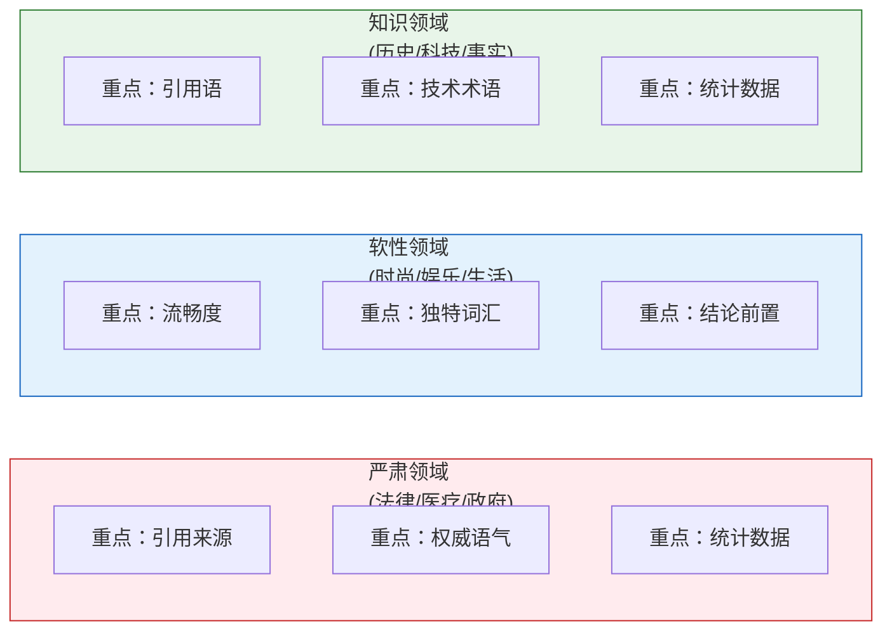

使用方式（在浏览器中操作，无需命令行）：

1. 打开 Web 界面「内容优化」页（启动 Web 服务后访问）。
2. 粘贴或上传待优化文章。
3. 在「领域类型」下拉中选择 **严肃 / 软性 / 知识**，系统自动推荐最优策略组合。

### 完整优化流程

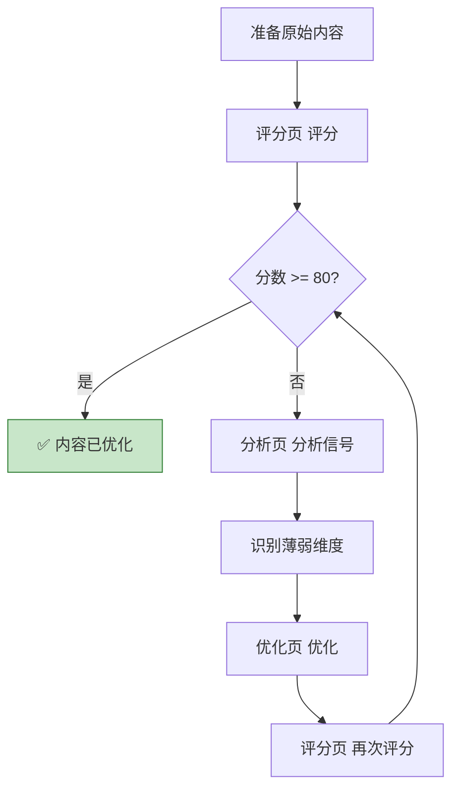

---

## 🏢 品牌可见度审计指南

### 什么是品牌可见度？

当用户在 AI 搜索引擎中搜索与你行业相关的问题时，**你的品牌是否被提及和引用**？

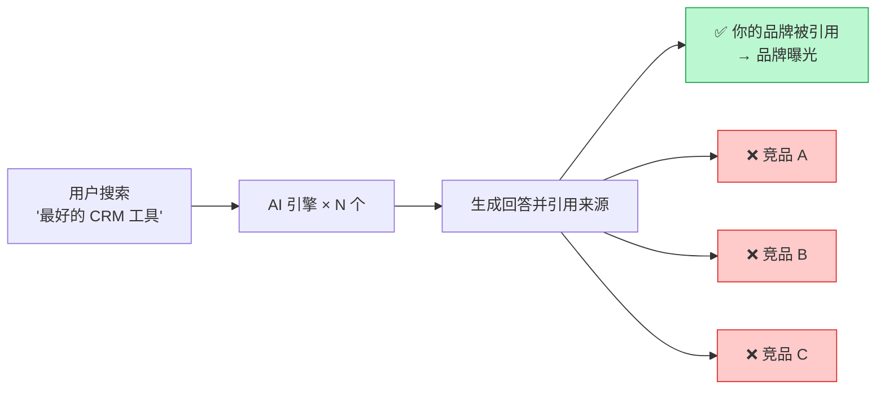

### 🚀 3 步快速审计流程图

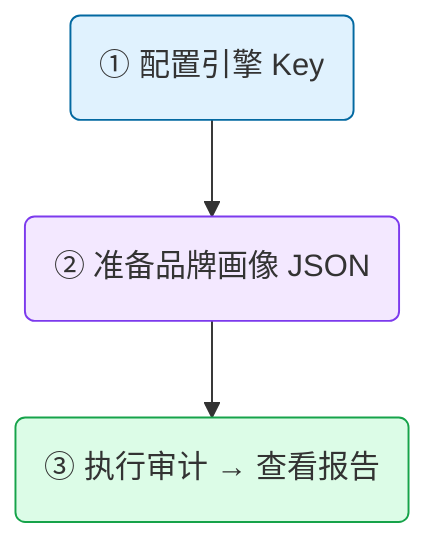

#### ① 配置引擎 API Key

```bash
# .env 中配置（配置几个就审计几个）
GEO_GLM_KEY=xxx          # 🟣 智谱 GLM（有免费额度，推荐首选）
GEO_DEEPSEEK_KEY=xxx     # 🔴 DeepSeek（便宜好用）
GEO_KIMI_KEY=xxx         # 🌙 Kimi（长文本）
GEO_OPENAI_KEY=xxx       # 🔵 ChatGPT（效果稳定）
GEO_PERPLEXITY_KEY=xxx   # 🟡 Perplexity（搜索增强）
```

#### ② 准备品牌画像（BrandProfile 结构）

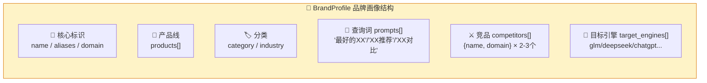

创建 `brand-profile.json`（对应上面结构）：

```json
{
  "name": "Acme",
  "aliases": ["Acme Inc", "Acme科技"],
  "domain": "acme.com",
  "products": ["Acme CRM", "Acme Analytics"],
  "category": "SaaS",
  "prompts": ["最好的CRM工具", "推荐客户管理软件", "CRM系统对比"],
  "competitors": [
    {"name": "HubSpot", "domain": "hubspot.com"},
    {"name": "Salesforce", "domain": "salesforce.com"}
  ],
  "target_engines": ["glm", "deepseek", "chatgpt"]
}
```

#### ③ 执行审计

Web 界面方式（可视化热力矩阵 + 趋势图，推荐）：

```bash
./bin/geo
# 打开 http://localhost:8080 → 「品牌审计」面板，填写品牌画像即可审计
```

> 原 `geo brand audit` 命令行已移除，统一在「品牌审计」前端页操作。

### BVS 评分解读

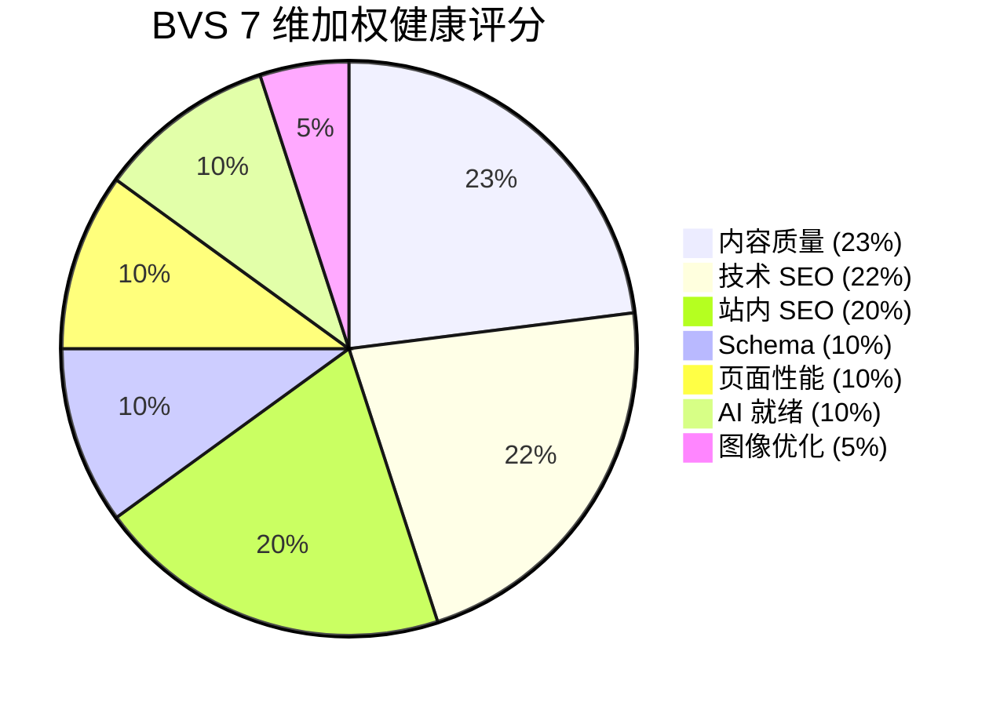

| 分数 | 等级 | 状态 | 行动建议 |
|---|---|---|---|
| 80-100 | A | 优秀 | 保持监测，关注竞品动向 |
| 70-79 | B | 良好 | 补强薄弱维度 |
| 60-69 | C | 一般 | 系统性优化 |
| 40-59 | D | 较差 | 全面整改 |
| <40 | F | 危险 | 紧急优化 |

### 5 类告警信号

系统会自动对比历史审计结果，检测 5 类异常：

```mermaid
flowchart TD
    A["定时审计触发"] --> B["对比上次审计结果"]
    B --> C1["🚨 竞品涌现<br/>新竞品进入 Top 3"]
    B --> C2["🚨 品牌消失<br/>从引用列表消失"]
    B --> C3["🚨 声量下降<br/>引用率下降 >20%"]
    B --> C4["🚨 位置下滑<br/>引用排名下降 >3"]
    B --> C5["🚨 模型分歧<br/>引擎间结论冲突"]

    C1 & C2 & C3 & C4 & C5 --> D["Webhook 告警通知"]

    style D fill:#ffebee,stroke:#c62828
```

### 定时审计配置

```bash
# .env 中配置定时审计
GEO_SCHEDULER_ENABLED=true
GEO_SCHEDULER_WEBHOOK=https://hooks.slack.com/services/xxx  # 可选

# 也可以通过 Web UI 手动触发
# http://localhost:8080 → 定时审计 → 触发
```

---

## 📦 离线工商库使用指南

### 数据从哪来，怎么用？

```mermaid
flowchart LR
    subgraph INGEST["📥 数据导入阶段（一次性）"]
        direction TB
        SRC["🌐 种子数据源<br/>guichong/-/tree/json<br/>31省×42年 JSON"]
        SRC --> INIT["初始化：deploy/initdb<br/>01建库 + 02建表/索引"]
        INIT --> IMP["「工商库导入」页<br/>上传 JSON / GitHub 直连<br/>3种格式自动识别"]
        IMP --> READY["✅ 1000万+数据就绪"]
    end

    subgraph USAGE["🔎 日常查询阶段"]
        direction TB
        QRY["关键词输入<br/>'短视频'/'云计算'..."] --> SEARCH["「品牌管理」页模糊搜索<br/>MATCH AGAINST IN BOOLEAN MODE"]
        SEARCH --> AUTO["🌐 Web 下拉补全<br/>+来源Tag徽章"]
        AUTO --> DISCOVER["✨ 「关键词发现」页<br/>关键词→公司→GEO报告"]
    end

    INGEST --> USAGE

    style INGEST fill:#e0f2fe,stroke:#0369a1
    style USAGE fill:#dcfce7,stroke:#16a34a
```

### Autocomplete 5 级数据来源优先级

```mermaid
graph TB
    P1["① 🔴 实时核验<br/>China-Check MCP<br/>国家公示系统最新<br/>优先级最高"]
    P1 --> P2["② 🟢 离线工商库<br/>千万级 FULLTEXT(ngram)<br/>1978-2019 历史"]
    P2 --> P3["③ 🔵 SinoFacts 知识库<br/>383家中国软件企业<br/>高置信度画像"]
    P3 --> P4["④ 🟡 联网搜索<br/>（可选需代理）"]
    P4 --> P5["⑤ 🟣 LLM 自身知识<br/>仅兜底用"]

    style P1 fill:#fee2e2,stroke:#dc2626
    style P2 fill:#dcfce7,stroke:#16a34a
    style P3 fill:#dbeafe,stroke:#2563eb
    style P4 fill:#fef08a,stroke:#ca8a04
    style P5 fill:#e9d5ff,stroke:#7c3aed
```

### 操作命令速查（均已在 Web 界面提供）

```bash
# 1. 初始化空库（部署时执行一次）：
#    docker compose up -d mysql  # 自动执行 deploy/initdb/schema.sql（建账号+建库+全部表）
#    或手动: mysql -uroot -p < deploy/initdb/schema.sql
# 2A. 本地批量导入（推荐，全量）：
git clone --depth 1 -b json https://github.com/guichong/- ~/geo-erddb
#    打开「工商库导入」页 → 上传 ~/geo-erddb/Enterprise-Registration-Data/json/ 下的文件
# 2B. GitHub 直接下载（快速体验）：
#    打开「工商库导入」页 → 选 GitHub 直连，填 years=2019 provinces=广东,北京,上海
# 3. 统计信息：同页顶部「当前库状态」
# 4. 模糊搜索：在「品牌管理」页输入关键词
```

### China-Check 实时核验缓存管理

缓存预热 / 查看占用 / 压缩清理等运维操作现通过 `GET /api/v1/brand/chinacheck/cache` 等端点完成；日常核验由「品牌审计」页自动触发，无需命令行。

---

## 🤖 AI 就绪度检查指南

### 8 维检查 + 严重级分布

```mermaid
pie title 8 维 AI 就绪度 — 严重级权重
    "Critical 阻断级 40%<br/>robots.txt 爬虫屏蔽检查" : 40
    "High 高优先级 30%<br/>llms.txt + 结构化 Schema" : 30
    "Medium 中优先级 20%<br/>sitemap + TTFB性能 + H1层级" : 20
    "Low 低优先级 10%<br/>FAQ + Organization Schema" : 10
```

### CI 闸门工作流

```mermaid
flowchart LR
    DEPLOY["🚀 部署流水线触发"] --> CHECK["POST /api/v1/brand/readiness<br/>8 维检查 + 加权重算分"]
    CHECK --> SCORE["📊 0-100 评分 + A-F 等级"]
    SCORE --> GATE{"🚧 --ci-gate 阈值?<br/>例：80 分"}
    GATE -->|"✅ ≥ 阈值"| PASS["👍 exit 0<br/>流水线继续部署"]
    GATE -->|"❌ < 阈值"| FAIL["⛔ exit 1<br/>阻断流水线 + 输出整改项"]

    style PASS fill:#dcfce7,stroke:#16a34a
    style FAIL fill:#fecaca,stroke:#dc2626
```

### 使用

```bash
# 基本检查（输出 8 维明细 + 建议）：在「系统自检」或「品牌审计」页操作，
# 或调用端点：
curl -X POST http://localhost:8080/api/v1/brand/readiness \
  -H 'Content-Type: application/json' \
  -d '{"brand_name":"","url":"https://your-site.com"}'

# CI/CD 闸门模式（低于 80 分阻断）：调用 ci-gate 端点
curl -s -o /tmp/ci.json -w "%{http_code}" -X POST http://localhost:8080/api/v1/brand/readiness/ci-gate \
  -H 'Content-Type: application/json' \
  -d '{"url":"https://your-site.com","threshold":80}'
# 端点返回 200=通过，4xx/5xx=阻断（具体见响应体）
```

集成到 GitHub Actions：

```yaml
# .github/workflows/deploy.yml
- name: 🚧 AI 就绪度闸门
  run: |
    curl -s -o /tmp/ci.json -w "%{http_code}" -X POST http://localhost:8080/api/v1/brand/readiness/ci-gate \
      -H 'Content-Type: application/json' \
      -d '{"url":"https://your-site.com","threshold":80}'
    # 返回 200=通过（exit 0），4xx/5xx=阻断（exit 1）
```

### 8 维修复速查表

| 检查项 | 严重级 | 修复方法 |
|---|---|---|
| robots.txt | 🔴 Critical | `User-agent: GPTBot\nAllow: /` |
| llms.txt | 🟠 High | 在 `/llms.txt` 写站点摘要+授权 |
| 结构化数据 | 🟠 High | 加 Schema.org JSON-LD 标记 |
| sitemap.xml | 🟡 Medium | 生成 sitemap 并 robots.txt 指向 |
| TTFB 性能 | 🟡 Medium | 优化 CDN / 缓存 / 数据库索引 |
| H1 标题 | 🟡 Medium | 每页唯一 H1 + 正确 H2/H3 层级 |
| FAQ Schema | 🟢 Low | 加 FAQPage 问答结构化 |
| Organization | 🟢 Low | 加 Organization + sameAs 社交链接 |

---

## ❓ 常见问题

### 功能 × 是否需要 LLM Key — 分类矩阵

```mermaid
graph TB
    subgraph FREE["🟢 ❌ 无需 LLM Key — 开箱即用"]
        direction TB
        F1["内容优化页 — 评分 / 分析 / 策略列表"]
        F4["工商库导入页 — 工商库管理"]
        F5["系统自检页 — AI 就绪度检查"]
        F6["品牌审计页 — 行业类型识别"]
        F7["品牌审计页 — Local SEO 审计"]
        F8["Web 服务（本页所有功能）"]
    end

    subgraph PAID["🔴 ✅ 需要 LLM Key — 调用大模型"]
        direction TB
        P1["内容优化页 — 改写优化"]
        P2["品牌审计页 — 多引擎品牌审计"]
        P3["品牌审计页 — Top Source 归因分析"]
        P4["品牌审计页 — AutoGEO 规则重写"]
        P5["品牌审计页 — 社媒+KOL 情报"]
        P6["关键词发现页 — 完整审计"]
    end

    style FREE fill:#dcfce7,stroke:#16a34a
    style PAID fill:#fecaca,stroke:#dc2626
```

### Q: 不配置 LLM Key 能用吗？

可以。以下功能不需要 LLM Key：
- 内容优化页 — GEO 评分 / 分析 / 策略列表
- 工商库导入页 — 工商库管理
- 系统自检页 — AI 就绪度检查
- 品牌审计页 — 行业识别 / Local SEO 审计

需要 LLM Key 的功能：
- 内容优化页 — 调用大模型改写内容
- 品牌审计页 — 调用 AI 引擎查询品牌可见度

### Q: 支持哪些 AI 引擎？

#### 🧠 13 引擎能力矩阵（按地域×定位）

```mermaid
graph TB
    subgraph OVERSEAS["🌍 海外引擎（5 个）"]
        direction LR
        O1["🔵 ChatGPT<br/>综合能力标杆"]
        O2["🟡 Perplexity<br/>搜索增强专精"]
        O3["🟢 Gemini<br/>Google 生态"]
        O4["🟠 Claude<br/>长文+安全"]
        O5["⚪ DuckDuckGo 等<br/>隐私优先"]
    end

    subgraph DOMESTIC["🇨🇳 国产引擎（8 个）"]
        direction LR
        D1["🔴 通义千问<br/>阿里云"]
        D2["🟣 智谱GLM<br/>❗免费额度"]
        D3["🔴 DeepSeek<br/>❗性价比王"]
        D4["🌙 Kimi<br/>长文本 200K"]
        D5["🔵 文心<br/>百度"]
        D6["🟠 豆包<br/>字节"]
        D7["🟤 星火<br/>讯飞"]
        D8["⚪ 元宝/小米<br/>腾讯+MiLM"]
    end

    subgraph BASE["🔧 共用技术底座"]
        B["OpenAI 兼容协议基类<br/>统一发送/解析/Token计算"]
    end

    OVERSEAS --> BASE
    DOMESTIC --> BASE

    style OVERSEAS fill:#dbeafe,stroke:#2563eb
    style DOMESTIC fill:#fee2e2,stroke:#dc2626
    style BASE fill:#dcfce7,stroke:#16a34a
```

| 引擎 | 环境变量 | 一句话推荐 |
|---|---|---|
| 🔵 ChatGPT | `GEO_OPENAI_KEY` | 效果稳定，海外首选 |
| 🟡 Perplexity | `GEO_PERPLEXITY_KEY` | 搜索增强，数据源全 |
| 🟢 Gemini | `GEO_GEMINI_KEY` | Google 生态用户 |
| 🟠 Claude | `GEO_CLAUDE_KEY` | 长文+安全合规 |
| 🔴 通义千问 | `GEO_QWEN_KEY` | 阿里云生态 |
| 🟣 智谱 GLM | `GEO_GLM_KEY` | **每天免费额度，新手首选** |
| 🔴 DeepSeek | `GEO_DEEPSEEK_KEY` | **¥1/M tokens，最便宜** |
| 🌙 Kimi | `GEO_KIMI_KEY` | 长上下文 200K+ |
| 🔵 文心一言 | `GEO_WENXIN_KEY` | 百度 |
| 🟠 豆包 | `GEO_DOUBAO_KEY` | 字节 |
| 🟤 讯飞星火 | `GEO_XUNFEI_KEY` | 科大讯飞 |
| ⚪ 元宝/混元 | `GEO_YUANBAO_KEY` | 腾讯 |
| ⚪ 小米 | `GEO_XIAOMI_KEY` | MiLM |

### Q: 如何作为 MCP Server 被 AI 编程助手调用？

#### 🤖 MCP 接入拓扑图

```mermaid
graph LR
    subgraph CLIENT["🖥️ AI 编程客户端"]
        C1["💬 Claude Code"]
        C2["⌨️ Cursor IDE"]
        C3["🧠 TraeCode IDE"]
    end

    subgraph MCP["🧩 MCP Server (HTTP)<br/>随 Web 服务启动 :9090/mcp"]
        T1["🧰 brand_audit<br/>品牌可见度审计"]
        T2["✍️ optimize<br/>内容优化"]
        T3["🏢 search_companies<br/>离线工商库搜索"]
        T4["✅ chinacheck<br/>实时工商核验"]
        T5["🤖 readiness<br/>AI 就绪度检查"]
    end

    CLIENT -->|"mcpServers 配置"| MCP

    style CLIENT fill:#e0f2fe,stroke:#0369a1
    style MCP fill:#fef3c7,stroke:#d97706
```

配置方式（只需一次）：

```json
{
  "mcpServers": {
    "geo": {
      "url": "http://localhost:9090/mcp",
      "headers": { "X-API-Key": "${GEO_MCP_API_KEY}" }
    }
  }
}
```

MCP Server 已随 Web 服务同进程启动（默认 `:9090` `/mcp`），无需单独运行命令；可用 `GEO_MCP_PORT` 改端口、`GEO_MCP_API_KEY` 设鉴权。

### Q: 数据库需要额外安装吗？

需要准备一个 **MySQL 8.0+ 实例**（本地 Docker / 云 RDS / 自建均可），单实例即可承载全部模块：
- 离线工商库（千万级行 + FULLTEXT ngram 中文检索）
- 审计历史库（时序写入 + JSON 快照）
- 账号/会话库（用户、工作区、刷新令牌）
- China-Check 查询缓存（KV 表 + TTL + expire_at 索引）

通过环境变量分别配置 DSN：
- `GEO_OFFLINE_MYSQL_DSN`
- `GEO_HISTORY_MYSQL_DSN`
- `GEO_AUTH_MYSQL_DSN`
- `GEO_CHINACHECK_MYSQL_DSN`（或切换为 Redis：`GEO_CHINACHECK_REDIS_DSN`，分布式场景推荐）

> 表结构由部署初始化完成（`deploy/initdb/schema.sql` 单文件全量：建账号+建库+19 张表+索引，mysql 容器首次启动自动执行），应用内不内嵌迁移。

### Q: GEO 优化后多久能看到效果？

```mermaid
timeline
    title GEO 优化效果时间线
    即时 : 内容结构化优化<br/>AI 更容易解析引用
    1-2 周 : AI 引擎重新索引内容<br/>引用率开始提升
    1-2 月 : 品牌可见度显著改善<br/>BVS 评分上升
    持续 : 定期审计 + 持续优化<br/>保持竞争优势
```

> GEO 是一个持续过程，建议每周审计一次品牌可见度，根据结果调整内容策略。

---

## 📊 本文档图表清单（共计 26 张）

| # | 类型 | 章节 | 说明 |
|---|---|---|---|
| 1 | mindmap | 🗺 文档导览 | 入门指南 5 大模块导航 |
| 2 | flowchart LR | 什么是 GEO | AI 引用与否对比图 |
| 3 | flowchart TB | 什么是 GEO | AI 三阶段引用机制（检索→生成→引用） |
| 4 | timeline | 为什么需要 GEO | 搜索方式 4 阶段演进时间线 |
| 5 | xychart-beta | 为什么需要 GEO | 9 种 GEO 策略引用率提升柱状图 |
| 6 | graph TB | GEO vs SEO | 关注点对比（SEO vs GEO） |
| 7 | graph LR | GEO vs SEO | 6 维雷达对比表 |
| 8 | graph TB | 本项目能做什么 | 5 大引擎 × 3 种使用方式全景 |
| 9 | flowchart LR | 5 分钟快速开始 | 安装→配置→评分→优化→Web 5 步流 |
| 10 | graph TB | 第一步安装 | 源码 / go install / Docker 3 种方式对比 |
| 11 | flowchart TD | 第二步配置 | **LLM 引擎选型决策树**（新） |
| 12 | graph LR | 内容优化 | **GEO 0-100 评分等级带**（新） |
| 13 | pie | 内容优化 | 6 维评分权重饼图 |
| 14 | graph TB | 内容优化 | **9 法效果×实施成本四象限矩阵**（新） |
| 15 | graph LR | 内容优化 | 严肃/软性/知识三大领域策略 |
| 16 | flowchart TB | 内容优化 | 评分→分析→优化 闭环流程 |
| 17 | flowchart LR | 品牌审计 | 品牌被引用 vs 竞品对比 |
| 18 | flowchart TD | 品牌审计 | **3 步快速审计流程**（新） |
| 19 | graph TB | 品牌审计 | **BrandProfile 画像结构图**（新） |
| 20 | pie | 品牌审计 | BVS 7 维加权健康评分饼图 |
| 21 | flowchart TD | 品牌审计 | 5 类告警信号 → Webhook 决策流 |
| 22 | flowchart LR | 离线工商库 | **导入→查询两阶段流水线**（新） |
| 23 | graph TB | 离线工商库 | **5 级数据来源优先级链**（新） |
| 24 | pie | AI 就绪度 | **8 维严重级分布饼图**（新） |
| 25 | flowchart LR | AI 就绪度 | **CI 闸门工作流（通过/阻断）**（新） |
| 26 | graph TB | FAQ | **功能×LLM Key 分类矩阵**（新） |
| 27 | graph TB | FAQ | **13 引擎能力矩阵（海外×国产×基类）**（新） |
| 28 | graph LR | FAQ | **MCP Server 接入拓扑图**（新） |
| 29 | timeline | FAQ | GEO 优化效果时间线 |
