# GEO 入门指南

> 从零开始了解 GEO（生成式引擎优化），并学会使用本项目提升内容在 AI 搜索引擎中的可见度。

---

## 目录

- [什么是 GEO？](#什么是-geo)
- [为什么需要 GEO？](#为什么需要-geo)
- [GEO vs SEO：有什么不同？](#geo-vs-seo有什么不同)
- [本项目能做什么？](#本项目能做什么)
- [5 分钟快速开始](#5-分钟快速开始)
- [内容优化实战指南](#内容优化实战指南)
- [品牌可见度审计指南](#品牌可见度审计指南)
- [离线工商库使用指南](#离线工商库使用指南)
- [AI 就绪度检查指南](#ai-就绪度检查指南)
- [常见问题](#常见问题)

---

## 什么是 GEO？

**GEO**（Generative Engine Optimization，生成式引擎优化）是让内容更容易被 AI 搜索引擎**引用**的优化方法。

当用户向 ChatGPT、Perplexity、Gemini、Claude、通义千问等 AI 助手提问时，AI 会从海量内容中**选择并引用**部分来源。GEO 的目标是让你的内容成为 AI 的"首选引用源"。

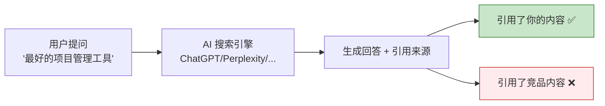

### AI 引用内容的机制

AI 搜索引擎生成回答时，会经历三个阶段：

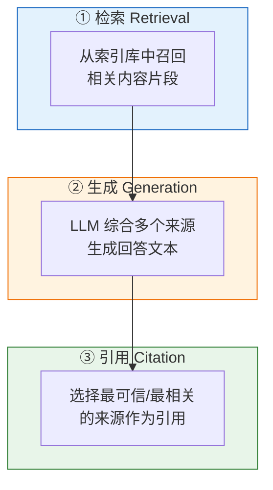

GEO 优化的核心就是：**让你的内容在以上三个阶段都更容易被选中。**

---

## 为什么需要 GEO？

### 用户搜索习惯正在改变

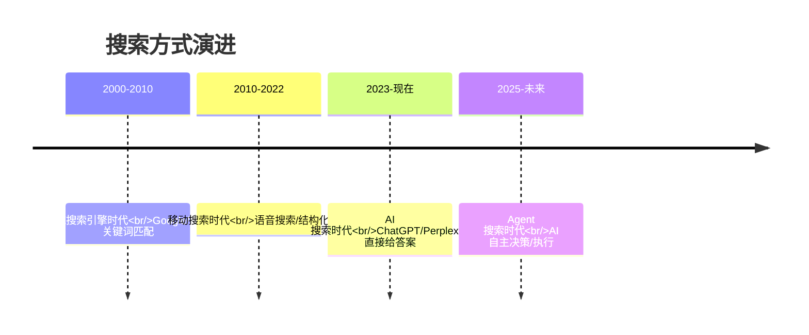

### 传统 SEO 正在失效

| 维度 | 传统 SEO | AI 搜索时代 |
|---|---|---|
| 用户行为 | 输入关键词 → 翻页点击 | 提问 → 直接看答案 |
| 排名位置 | 10 个蓝色链接 | AI 生成的 1 个答案 |
| 流量来源 | 搜索结果页点击 | AI 回答中的引用 |
| 优化目标 | 排名靠前 | 被 AI 引用 |
| 内容形式 | 关键词堆砌 | 结构化、可引用的内容 |

### 数据说话

Princeton 大学 KDD 2024 论文实测了 9 种 GEO 策略的效果：

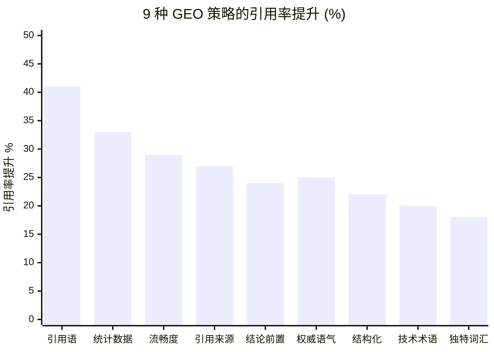

> **关键发现**：仅仅添加权威引用语就能提升 41% 的被引用概率！

---

## GEO vs SEO：有什么不同？

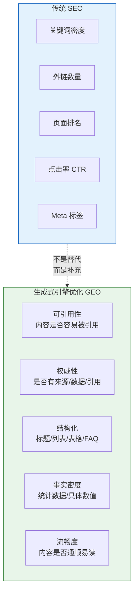

| 对比项 | SEO | GEO |
|---|---|---|
| 优化目标 | 搜索引擎排名 | AI 回答中的引用 |
| 核心指标 | 排名位置 / 点击率 | 引用率 / 品牌提及率 |
| 内容策略 | 关键词 + 外链 | 引用来源 + 统计数据 + 结构化 |
| 技术要求 | Meta 标签 / Sitemap | llms.txt / Schema.org / robots.txt |
| 衡量方式 | Google Search Console | 多引擎审计 + BVS 评分 |
| 适用场景 | 传统搜索流量 | AI 助手品牌曝光 |

> **建议**：SEO 和 GEO 同时做。SEO 保证传统搜索流量，GEO 抢占 AI 搜索新流量。

---

## 本项目能做什么？

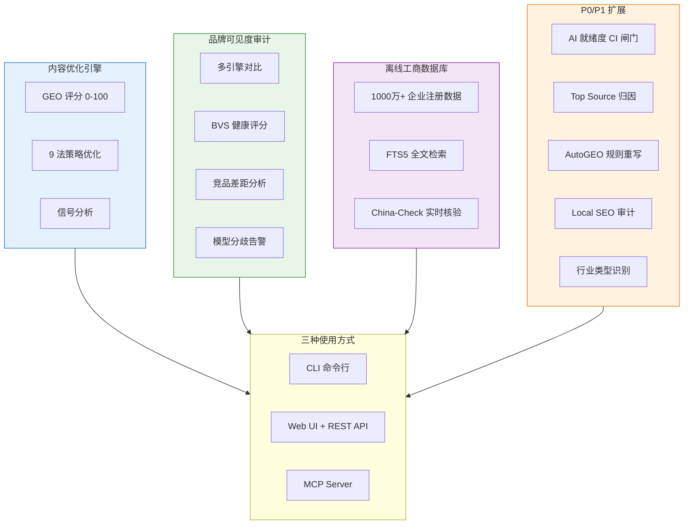

---

## 5 分钟快速开始

### 第一步：安装

```bash
# 方式一：从源码编译（需要 Go 1.21+）
git clone https://github.com/deep2code/geo.git
cd geo
make build        # 产物在 bin/geo

# 方式二：Go install
go install ./cmd/geo

# 方式三：Docker
docker compose up -d    # 访问 http://localhost:8080
```

### 第二步：配置 LLM（可选但推荐）

```bash
cp .env.example .env
```

编辑 `.env` 文件：

```bash
# 使用 OpenAI
GEO_LLM_KEY=sk-xxx
GEO_LLM_MODEL=gpt-4o-mini

# 或使用国内大模型（以 DeepSeek 为例，便宜好用）
GEO_LLM_KEY=sk-xxx
GEO_LLM_BASE=https://api.deepseek.com
GEO_LLM_MODEL=deepseek-chat

# 或智谱 GLM（有免费额度）
GEO_LLM_KEY=xxx
GEO_LLM_BASE=https://open.bigmodel.cn/api/paas/v4
GEO_LLM_MODEL=glm-4-flash
```

> **不配置 LLM 也能用**：评分、分析、规则化预处理不需要 LLM。只有"调用大模型改写内容"才需要。

### 第三步：给内容打分

```bash
# 直接评分（无需 LLM Key）
echo "Python 是一种广泛使用的编程语言。" | geo score
```

输出示例：
```
GEO 评分: 42.3/100  等级: F

评分明细：
  CitabilitySignals   12.0 / 30  (40%)
  Structure            8.0 / 20  (40%)
  Fluency             13.0 / 15  (87%)
  Keyword              3.0 / 15  (20%)
  UniqueWords          3.0 / 10  (30%)
  Technicality         3.0 / 10  (30%)
```

### 第四步：优化内容

```bash
# 优化为更适合 AI 引用的格式
geo optimize -f my-article.md --engine chatgpt --engine perplexity -o optimized.md
```

### 第五步：启动 Web 界面

```bash
# 启动服务
geo serve -p 8080
# 或用脚本（自动编译 + 杀旧进程 + 后台启动）
bash scripts/run.sh

# 打开浏览器
open http://localhost:8080
```

---

## 内容优化实战指南

### 评分等级说明

| 等级 | 分数 | 含义 | 建议 |
|---|---|---|---|
| A | 90-100 | 优秀，极易被引用 | 保持，定期复查 |
| B | 80-89 | 良好 | 补强薄弱维度 |
| C | 70-79 | 及格 | 重点优化结构化 |
| D | 60-69 | 较弱 | 全面优化 |
| F | <60 | 差 | 需要重写 |

### 6 维评分详解

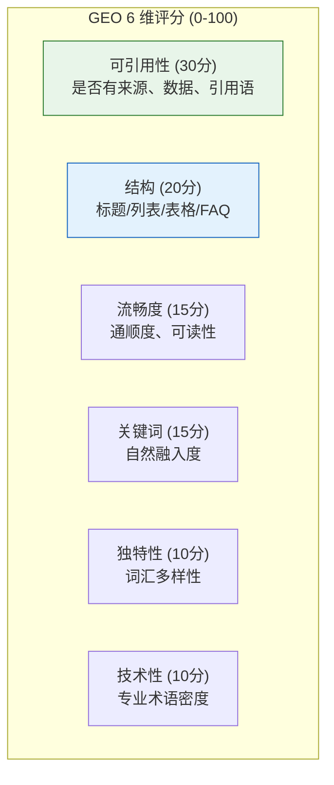

### 9 法优化策略

以下是 Princeton 论文验证有效的 9 种策略，按效果从高到低排列：

#### 1. 引用语 (+41%) — 效果最佳

在内容中加入权威人物/机构的直接引用语。

```markdown
❌ 改进前：Python 是最流行的编程语言之一。

✅ 改进后：根据 TIOBE 2024 年度报告，Python 连续第五年位居编程语言排行榜第一。
          TIOBE 创始人 Paul Jansen 表示："Python 的增长势头前所未见。"
```

#### 2. 统计数据 (+33%)

用具体数字替代模糊描述。

```markdown
❌ 改进前：很多人使用 Python。

✅ 改进后：根据 Stack Overflow 2024 开发者调查，Python 拥有 51.2% 的使用率，
          全球开发者超过 1700 万。
```

#### 3. 流畅度 (+29%)

确保内容通顺易读，AI 更倾向引用流畅的内容。

```markdown
❌ 改进前：Python。简单。易学。很多库。数据分析好用。机器学习也好。

✅ 改进后：Python 是一门简单易学的编程语言，拥有丰富的第三方库生态。
          在数据分析和机器学习领域应用尤为广泛。
```

#### 4. 引用来源 (+27%)

为论断补充可信来源。

```markdown
❌ 改进前：Python 适合数据分析。

✅ 改进后：Python 适合数据分析。来源：IEEE Spectrum 2024 编程语言排名中，
          Python 在数据分析领域排名第一 [1]。
```

#### 5-9. 其他策略

| 策略 | 效果 | 做法 |
|---|---|---|
| 权威语气 (+25%) | 用确定语气替代犹豫表达 | "可能" → "研究表明" |
| 结论前置 (+24%) | 核心答案放在开头 | 先给结论，再展开 |
| 结构化 (+22%) | 使用标题/列表/表格 | 内容分段、加小标题 |
| 技术术语 (+20%) | 补充专业术语 | 适度加入行业术语 |
| 独特词汇 (+18%) | 丰富词汇多样性 | 避免重复用词 |

### 领域适配策略

不同领域的内容，最优策略不同：

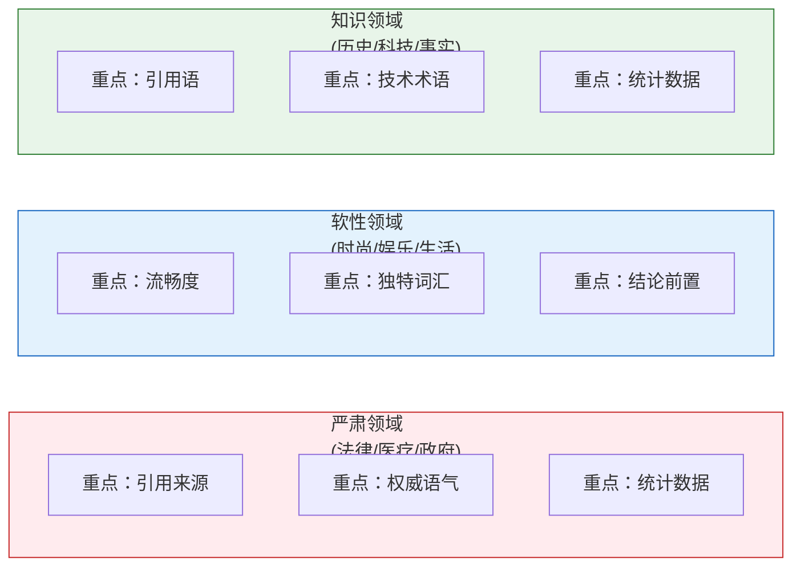

使用方式：
```bash
# 指定领域类型，系统自动推荐最优策略组合
geo optimize -f article.md --domain serious     # 严肃领域
geo optimize -f article.md --domain soft        # 软性领域
geo optimize -f article.md --domain knowledge   # 知识领域
```

### 完整优化流程

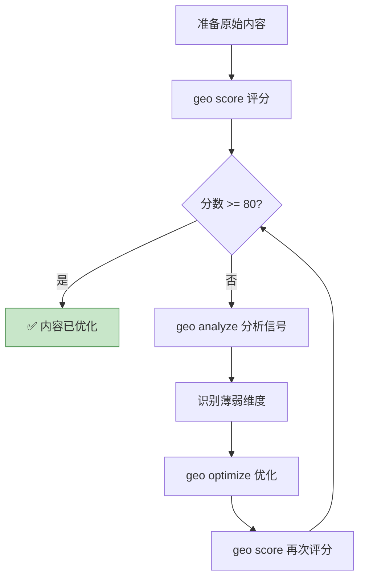

---

## 品牌可见度审计指南

### 什么是品牌可见度？

当用户在 AI 搜索引擎中搜索与你行业相关的问题时，**你的品牌是否被提及和引用**？

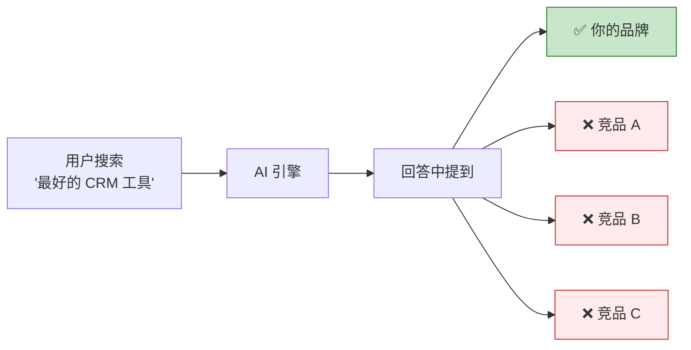

### 快速开始品牌审计

#### 1. 配置引擎 API Key

```bash
# .env 中配置你想审计的引擎
GEO_GLM_KEY=xxx          # 智谱 GLM（有免费额度，推荐）
GEO_DEEPSEEK_KEY=xxx     # DeepSeek（便宜）
GEO_KIMI_KEY=xxx         # Kimi
GEO_OPENAI_KEY=xxx       # ChatGPT
GEO_PERPLEXITY_KEY=xxx   # Perplexity
```

#### 2. 准备品牌画像

创建 `brand-profile.json`：

```json
{
  "name": "Acme",
  "aliases": ["Acme Inc", "Acme科技"],
  "domain": "acme.com",
  "products": ["Acme CRM", "Acme Analytics"],
  "category": "SaaS",
  "prompts": [
    "最好的CRM工具",
    "推荐客户管理软件",
    "CRM系统对比"
  ],
  "competitors": [
    {"name": "HubSpot", "domain": "hubspot.com"},
    {"name": "Salesforce", "domain": "salesforce.com"}
  ],
  "target_engines": ["glm", "deepseek", "chatgpt"]
}
```

#### 3. 执行审计

```bash
# CLI 方式
geo brand-audit -f brand-profile.json

# 输出报告到文件
geo brand-audit -f brand-profile.json -o report.json

# Web 界面方式
geo serve
# 浏览器打开 http://localhost:8080 → 品牌审计面板
```

### BVS 评分解读

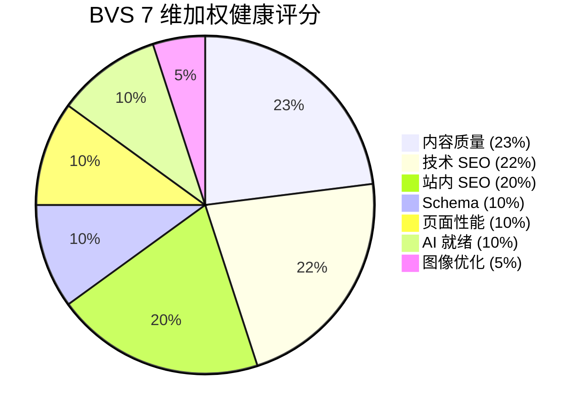

| 分数 | 等级 | 状态 | 行动建议 |
|---|---|---|---|
| 80-100 | A | 优秀 | 保持监测，关注竞品动向 |
| 70-79 | B | 良好 | 补强薄弱维度 |
| 60-69 | C | 一般 | 系统性优化 |
| 40-59 | D | 较差 | 全面整改 |
| <40 | F | 危险 | 紧急优化 |

### 5 类告警信号

系统会自动对比历史审计结果，检测 5 类异常：

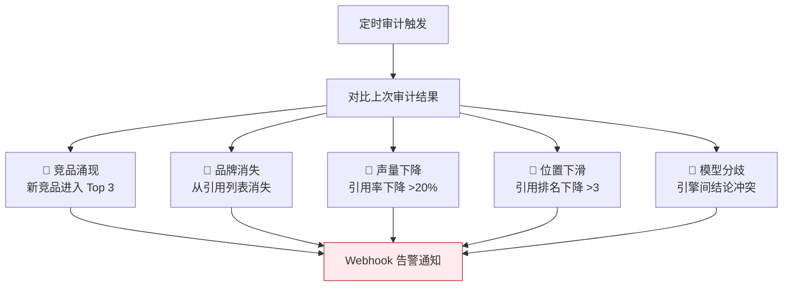

### 定时审计配置

```bash
# .env 中配置定时审计
GEO_SCHEDULER_ENABLED=true
GEO_SCHEDULER_WEBHOOK=https://hooks.slack.com/services/xxx  # 可选

# 也可以通过 Web UI 手动触发
# http://localhost:8080 → 定时审计 → 触发
```

---

## 离线工商库使用指南

### 什么是离线工商库？

本项目内置了 1978-2019 年中国大陆 31 个省份的工商注册数据（1000 万+ 条），支持按企业名称、法人、地址等模糊搜索。

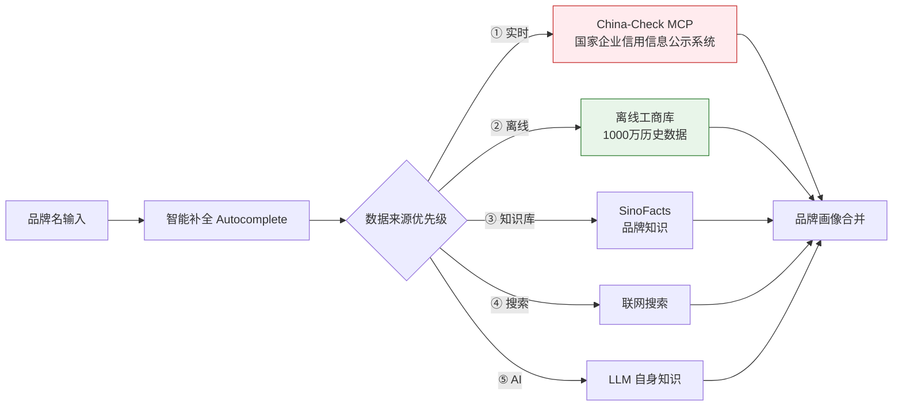

### 导入数据

```bash
# 1. 初始化空库
geo brand-db init

# 2. 方式 A：从本地文件导入（推荐）
git clone --depth 1 -b json https://github.com/guichong/- ~/geo-erddb
geo brand-db import-file -d ~/geo-erddb/Enterprise-Registration-Data/json/

# 2. 方式 B：直接从 GitHub 下载导入（适合少量样本）
geo brand-db import-github --years 2019 --provinces 广东,北京,上海

# 3. 查看统计
geo brand-db stats

# 4. 搜索
geo brand-db search "腾讯" -n 5
```

### China-Check 实时核验

```bash
# 预热缓存（批量查询常见企业）
geo brand-cache warm --queries "腾讯,阿里巴巴,字节跳动,华为"

# 查看缓存状态
geo brand-cache stats

# 清理过期缓存
geo brand-cache compact
```

---

## AI 就绪度检查指南

### 什么是 AI 就绪度？

你的网站是否已经准备好被 AI 搜索引擎**发现和理解**？8 维检查：

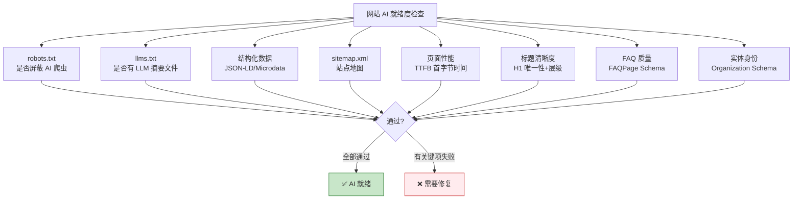

### 使用方式

```bash
# 基本检查
geo readiness --url https://your-site.com

# CI/CD 闸门模式（低于 80 分则退出码非 0，阻断流水线）
geo readiness --url https://your-site.com --ci-gate 80
echo $?  # 0=通过，1=不通过
```

### 8 维检查详解

| 检查项 | 严重级 | 说明 | 修复方法 |
|---|---|---|---|
| robots.txt AI 爬虫 | Critical | 检查是否屏蔽 GPTBot/ClaudeBot 等 | `User-agent: GPTBot\nAllow: /` |
| llms.txt | High | 面向 LLM 的站点摘要文件 | 创建 `/llms.txt` 文件 |
| 结构化数据 | High | JSON-LD / Microdata | 添加 Schema.org 标记 |
| sitemap.xml | Medium | 站点地图 | 生成并提交 sitemap |
| 页面性能 TTFB | Medium | 首字节时间 < 600ms | 优化服务器响应 |
| 标题清晰度 | Medium | H1 唯一 + H2/H3 层级 | 检查标题层级 |
| FAQ 质量 | Low | FAQPage Schema 或问答文本 | 添加 FAQ 结构化数据 |
| 实体身份 | Low | Organization Schema + sameAs | 添加组织信息标记 |

### CI/CD 集成示例

```yaml
# .github/workflows/deploy.yml
- name: AI Readiness Gate
  run: |
    geo readiness --url https://your-site.com --ci-gate 80
    # 低于 80 分会返回非零退出码，阻断部署
```

---

## 常见问题

### Q: 不配置 LLM Key 能用吗？

可以。以下功能不需要 LLM Key：
- `geo score` — GEO 评分
- `geo analyze` — 信号分析
- `geo strategies` — 策略列表
- `geo brand-db` — 工商库管理
- `geo readiness` — AI 就绪度检查
- `geo serve` — Web 服务（评分/分析功能可用）

需要 LLM Key 的功能：
- `geo optimize` — 调用大模型改写内容
- `geo brand-audit` — 调用 AI 引擎查询品牌可见度

### Q: 支持哪些 AI 引擎？

| 引擎 | 环境变量 | 备注 |
|---|---|---|
| ChatGPT | `GEO_OPENAI_KEY` | OpenAI 原生 |
| Perplexity | `GEO_PERPLEXITY_KEY` | 搜索增强 |
| Gemini | `GEO_GEMINI_KEY` | Google |
| Claude | `GEO_CLAUDE_KEY` | Anthropic |
| 通义千问 | `GEO_QWEN_KEY` | 阿里云 |
| 智谱 GLM | `GEO_GLM_KEY` | 有免费额度 |
| DeepSeek | `GEO_DEEPSEEK_KEY` | 便宜 |
| Kimi | `GEO_KIMI_KEY` | 月之暗面 |
| 文心一言 | `GEO_WENXIN_KEY` | 百度 |
| 豆包 | `GEO_DOUBAO_KEY` | 字节跳动 |
| 讯飞星火 | `GEO_XUNFEI_KEY` | 科大讯飞 |
| 元宝/混元 | `GEO_YUANBAO_KEY` | 腾讯 |
| 小米 | `GEO_XIAOMI_KEY` | MiLM |

### Q: 数据库需要额外安装吗？

不需要。默认全部使用零依赖后端：
- 离线工商库：纯 Go SQLite（`modernc.org/sqlite`）
- 审计历史库：纯 Go SQLite
- China-Check 缓存：JSONL 文件

生产环境可选切换：
- `GEO_OFFLINE_DB_TYPE=duckdb` — DuckDB（列式，千万级更快）
- `GEO_HISTORY_DB_TYPE=mysql` — MySQL（生产高并发）
- `GEO_CHINACHECK_CACHE_TYPE=redis` — Redis（分布式缓存）

### Q: 如何作为 MCP Server 被 AI 编程助手调用？

```bash
# 启动 MCP Server
geo mcp-server
```

在 Claude Code / Cursor / TraeCode 的 MCP 配置中添加：
```json
{
  "mcpServers": {
    "geo": {
      "command": "geo",
      "args": ["mcp-server"]
    }
  }
}
```

暴露的工具：`brand_audit` / `optimize` / `search_companies` / `chinacheck` / `readiness`

### Q: GEO 优化后多久能看到效果？

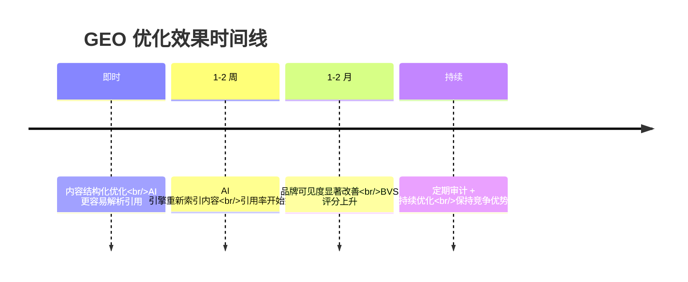

> GEO 是一个持续过程，建议每周审计一次品牌可见度，根据结果调整内容策略。
